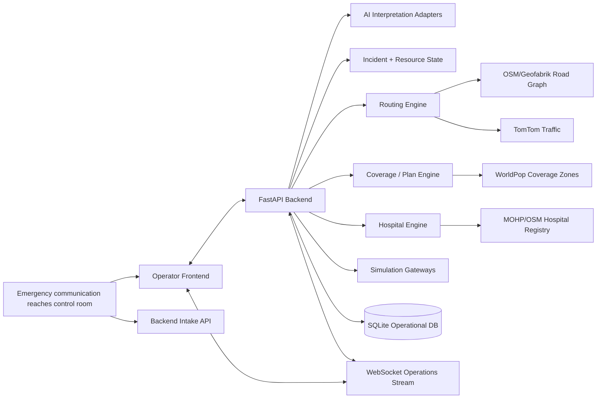

# SirenGrid — Technical Architecture & Implementation Plan v1.0

> **Status:** CANDIDATE FOR TECHNICAL LOCK  
> **Product authority:** `docs/MASTER_PLAN.md` v1.2 remains the product source of truth.  
> **Purpose:** Translate the locked SirenGrid product behavior into an implementation-ready software architecture, technical stack, module boundaries, data contracts, algorithms, runtime flows, tests, and execution plan.  
> **MVP geography:** Nasr City, Cairo  
> **Initial working/demo corridor:** Rabaa → Tayaran Street → Abbas El Akkad → Makram Ebeid → El Nasr Road  
> **Primary user:** Emergency Control Room Operator / Dispatcher  
> **Repository:** `MahmoudNagiubX/SirenGrid`

---

# 0. Executive Technical Summary

SirenGrid will be implemented as a **Python/FastAPI modular monolith** with a **React + TypeScript + MapLibre** operator frontend. The backend owns all operational truth and deterministic decision logic. AI is used only for interpretation, multimodal evidence understanding, semantic correlation, and controlled explanation; it never fabricates routes, ETAs, responder state, hospital load, or critical operational outcomes.

The system uses a real Nasr City road graph derived from OpenStreetMap/Geofabrik, real live TomTom traffic where available, WorldPop population data for coverage analysis, official/public hospital data for static facility information, and explicitly simulated operational state for responder GPS/status, live hospital load, traffic-signal state, corridor actuation, driver-alert delivery, and hospital acknowledgement.

The runtime architecture is intentionally **single-process and low-ops for the hackathon**, while keeping clean provider/gateway boundaries so real integrations or a stronger database can replace simulated/local adapters later without changing the product contract.

Core closed loop:

**Control-room input → AI/evidence interpretation → incident activation → candidate response plans → coverage simulation → human approval → traffic-aware route → simulated corridor/driver alert → hospital ranking/pre-alert → event-driven replanning → explanation/audit**

---

# 1. Architecture Goals

The architecture must optimize for:

1. **Full Master Plan behavior, not a reduced demo version.**
2. **Fast implementation in a hackathon timeline.**
3. **Real deterministic logic behind routing, coverage, scoring, plan comparison, and replanning.**
4. **Explicit real-vs-simulated boundaries.**
5. **Stable frontend/backend contracts so parallel development is possible.**
6. **Minimal unnecessary infrastructure.**
7. **Strong auditability, provenance, freshness, and human override.**
8. **Easy reuse of proven code from existing repositories.**
9. **A deterministic, replayable benchmark/demo mode.**
10. **A migration path to Greater Cairo and real integrations later without rewriting the product.**

---

# 2. Locked Architectural Principles

## A1 — Modular Monolith

Use one backend application with clearly separated modules. Do not use microservices, Kafka, Redis, Celery, Kubernetes, CQRS, or a distributed event bus for the MVP.

Reason: all core subsystems share state heavily, the team is small, the timeline is short, and a single process gives the least integration risk.

## A2 — Backend Is the Operational Source of Truth

The frontend displays state and sends user actions. It must not independently calculate:

- operational ETA,
- coverage,
- hospital ranking,
- responder availability,
- plan score,
- replanning decisions,
- incident confidence,
- simulated external-action success.

## A3 — Deterministic Core, AI at the Edges

Deterministic code calculates:

- routing,
- travel-time metrics,
- resource eligibility,
- plan generation,
- coverage,
- hospital ranking,
- corridor geometry/timing,
- alert geofence,
- freshness,
- state transitions,
- benchmark metrics.

AI handles:

- Egyptian Arabic speech/text interpretation,
- image evidence interpretation,
- structured extraction,
- semantic duplicate/report matching support,
- concise explanation/paraphrasing based only on calculated facts.

## A4 — All Important Data Carries Reality + Provenance

Dynamic/operational data must be traceable to:

`REAL_PUBLIC | REAL_LIVE | REAL_DERIVED | SIMULATED | SYNTHETIC`

and include source, last-updated time, freshness, and source reference where applicable.

## A5 — Human Approval Is a State Transition

Approval is not a visual button only. It creates an auditable backend state transition and locks the approved plan version as the currently active plan.

## A6 — Simulation Is an Adapter, Not Fake UI State

Responder GPS, hospital live load, traffic-light control, driver-alert delivery, and hospital acknowledgement are implemented through explicit simulation gateways. They generate real state changes inside SirenGrid while clearly identifying the external side as simulated.

## A7 — Replanning Is Event-Driven

Material state changes call the replanning evaluator. The system does not depend on an AI agent periodically “thinking” about whether to replan.

## A8 — One Stable API Contract

Frontend and backend work in parallel against versioned Pydantic/TypeScript-compatible JSON contracts. Contract changes that affect another developer require review before merge.

---

# 3. Selected Technical Stack

## Backend

- **Language:** Python 3.12+
- **API framework:** FastAPI
- **Validation/contracts:** Pydantic v2
- **ORM/persistence:** SQLAlchemy 2.x
- **MVP operational database:** SQLite with WAL mode
- **HTTP client:** httpx
- **Tests:** pytest
- **Formatting/lint:** Ruff

### Why SQLite for the MVP

The operational dataset is small, the app runs as one backend instance, and geospatial routing is handled by the in-memory OSM graph rather than database spatial queries. SQLite avoids database-server setup while preserving transactional state and audit history.

The schema should remain portable enough to migrate to PostgreSQL/PostGIS later if the project expands.

## Geospatial / Routing

- OSMnx
- NetworkX
- GeoPandas
- Shapely
- pyproj
- GeoJSON / GeoParquet for processed map assets
- GraphML for the routable graph

## Live Traffic

- TomTom Traffic Flow API
- TomTom Traffic Incidents API
- backend cache with timestamp/freshness metadata to avoid rate-limit waste

## Frontend

- React
- TypeScript
- Vite
- MapLibre GL JS
- TanStack Query for server state
- Zustand only for small local/operator UI state if needed
- Tailwind CSS or the frontend owner's chosen lightweight styling system
- Vitest + React Testing Library

## Realtime

- Native FastAPI WebSocket endpoint
- Single in-process connection manager
- No Redis for the MVP

## AI / ML

Use provider interfaces so exact model/provider can be swapped without touching core product logic.

### Speech-to-text

Primary interface: `SpeechToTextProvider`

Recommended initial implementation:
- configured cloud ASR for speed/reliability if available,
- local `faster-whisper` fallback for offline/demo resilience.

Evaluation:
- Egyptian-ASR-MGB-3,
- SirenGrid team-created Egyptian emergency-call evaluation set.

### Structured incident interpretation

Interface: `IncidentInterpreter`

Behavior:
- input transcript/text + optional evidence references,
- output strict structured JSON validated by Pydantic,
- unknown values must be `null`/unknown,
- no operational route/resource/hospital decisions are produced by the model.

### Image evidence

Interface: `VisionEvidenceInterpreter`

Behavior:
- describe operationally relevant visible evidence,
- identify possible fire/smoke/vehicle damage/road obstruction only when supported,
- never create patient diagnosis,
- preserve image as evidence with source metadata.

### Semantic similarity

Recommended local embeddings:
- multilingual sentence embedding model suitable for Arabic, e.g. multilingual E5 family.

Used for:
- report semantic similarity,
- not for autonomous dispatch.

## Deployment

MVP development:
- backend and frontend run locally in separate processes.

Demo deployment options:
- one containerized backend plus built frontend static assets,
- or two simple services if hosting platform requires it.

Do not design the architecture around a particular cloud provider.

---

# 4. System Context Diagram



---

# 5. Runtime Component Architecture

```text
frontend/
    Operator Web App
        ├── Incident Queue
        ├── Incident Detail / Corrections
        ├── Operational Map
        ├── Plan Comparison
        ├── Approval Controls
        ├── Hospital Panel
        ├── Timeline / Freshness
        └── Scenario Controls (demo/admin only)

backend/
    FastAPI App
        ├── API / WebSocket Layer
        ├── Incident Domain
        ├── Intake + AI Interpretation
        ├── Resource State
        ├── Routing + Traffic
        ├── Coverage
        ├── Response Planning
        ├── Hospital Ranking
        ├── Corridor + Driver Alert
        ├── Replanning
        ├── Freshness / Provenance
        ├── Timeline / Audit
        ├── Simulation Runtime
        └── Benchmark Runner

persistent/state assets
    ├── SQLite runtime database
    ├── GraphML road graph
    ├── GeoJSON/GeoParquet map/zone layers
    ├── scenario JSON fixtures
    └── uploaded demo evidence files
```

---

# 6. Proposed Repository Structure

Keep this structure compact. Only create a file when its responsibility is real.

```text
SirenGrid/
├── backend/
│   ├── app/
│   │   ├── main.py
│   │   ├── config.py
│   │   ├── db.py
│   │   ├── schemas.py
│   │   ├── incidents.py
│   │   ├── intake.py
│   │   ├── resources.py
│   │   ├── routing.py
│   │   ├── coverage.py
│   │   ├── planning.py
│   │   ├── hospitals.py
│   │   ├── operations.py
│   │   ├── simulation.py
│   │   └── websocket.py
│   ├── tests/
│   └── requirements.txt
├── frontend/
│   ├── src/
│   │   ├── api/
│   │   ├── components/
│   │   ├── features/
│   │   ├── map/
│   │   ├── App.tsx
│   │   └── main.tsx
│   └── package.json
├── data/
│   ├── raw/
│   ├── processed/
│   ├── evaluation/
│   ├── scenarios/
│   └── README.md
├── docs/
│   ├── MASTER_PLAN.md
│   ├── DECISIONS.md
│   └── TECHNICAL_ARCHITECTURE.md
├── AGENTS.md
├── CONTRIBUTING.md
└── README.md
```

### Important structure rule

Do not split each small function into a separate service/repository/helper file. Start with the above focused modules. Split a module only when it becomes genuinely too large or contains two clearly separate responsibilities.

---

# 7. Core Domain Model

## Incident

Core fields:

```text
id
incident_type
severity
confidence_level
status
latitude
longitude
location_text
casualty_count / casualty_range
trapped_person
road_blockage
required_services
current_plan_id
created_at
updated_at
```

Important rules:
- unknown is represented explicitly, never fabricated,
- severity and confidence are separate,
- operator correction records provenance/history,
- incident may become ACTIVE while details are incomplete.

## Report

```text
id
incident_id nullable until fusion decision
source_type
source_reference
raw_text/transcript
location metadata
received_at
data_reality
processing_status
```

## Evidence Item

Can be stored as report-linked JSON metadata for the MVP:

```text
type: transcript | image | location | operator_entry | responder_update | hospital_update
uri/path/reference
extracted_facts
provenance
confidence/support
created_at
```

## Emergency Resource

```text
id
resource_type
capability_tags
status
latitude
longitude
home_zone
assigned_incident_id
last_updated
source
freshness_status
data_reality = SIMULATED for MVP operational state
```

Allowed status values:

`AVAILABLE | RESERVED | ASSIGNED | EN_ROUTE | ON_SCENE | TRANSPORTING | OUT_OF_SERVICE`

## Hospital

```text
id
name
latitude
longitude
static_capabilities
static_capacity
simulated_free_capacity
simulated_load
accepting_state
incoming_cases
last_updated
source/freshness/data_reality
```

Static published capacity and simulated live availability must never be conflated.

## Response Plan

```text
id
incident_id
version
status: CANDIDATE | RECOMMENDED | APPROVED | REJECTED | SUPERSEDED
resource_assignments_json
routes_json
coverage_snapshot_json
hospital_option_json
corridor_plan_json
alert_region_json
metrics_json
score_breakdown_json
explanation_facts_json
created_at
```

## Approval

```text
id
plan_id
action
operator_reference
reason optional
created_at
```

## Timeline Event

Append-only operational history:

```text
id
incident_id
event_type
actor_type
payload_json
created_at
```

No event is silently deleted when current state changes.

---

# 8. Persistence Strategy

Use SQLite for mutable operational state. Do not store large geospatial data or media blobs inside the database.

## SQLite stores

- incidents,
- reports/evidence metadata,
- resources and mutable operational state,
- hospitals and mutable simulated load,
- response plans,
- approvals,
- timeline events,
- selected traffic/freshness snapshots when persistence is useful.

## Files store

- GraphML road graph,
- GeoJSON/GeoParquet layers,
- population aggregation,
- benchmark scenarios,
- evaluation datasets/metadata,
- uploaded synthetic/demo audio/images.

## Transaction rules

Critical state transitions must be transactional where possible:

- approve plan + assign resources,
- reject/supersede plan,
- manual incident correction + timeline event,
- resource unavailability + affected-plan marker.

Resource status must not be updated separately from plan approval in a way that allows double assignment.

---

# 9. Data Acquisition & Processing Architecture

The locked data list is implemented as reproducible preprocessing, not ad-hoc manual edits.

## Phase D1 — Geospatial Base

Sources:
- existing Nasr City assets from `Egypt-Smart-City-Digital-Twin`,
- Geofabrik Egypt OSM extract,
- Overpass API for signals/hospitals/stations/POIs.

Processing:
1. clip Egypt OSM extract to the Nasr City MVP boundary,
2. build directed driving graph,
3. preserve one-way and turn/access restrictions where OSMnx supports them,
4. add speed and base travel-time attributes,
5. extract traffic signals and important intersections,
6. export GraphML + frontend-ready GeoJSON.

The older road data is bootstrap/reference only; final road graph is refreshed from current OSM/Geofabrik.

## Phase D2 — Population Coverage

Source:
- WorldPop Egypt 2025 constrained 100 m.

Processing:
1. clip raster/cells to Nasr City,
2. spatially aggregate population into the existing 500 m operational zones,
3. store `zone_id`, geometry, centroid, population,
4. mark as REAL_DERIVED with WorldPop source reference.

## Phase D3 — Hospital Registry

Sources:
- MOHP official/public hospital records,
- OSM/Overpass location cross-check.

Processing:
1. normalize hospital name/location,
2. retain source-specific static capacity/capability where available,
3. never transform static capacity into live free capacity,
4. seed simulated current load separately.

## Phase D4 — Traffic

TomTom client returns traffic snapshots with:

```text
current_speed
free_flow_speed
current_travel_time
free_flow_travel_time
road_closure / incident state
last_updated
```

Snapshots are cached with TTL and mapped to nearby graph edges.

Fallback if TomTom is unavailable:
- keep last known snapshot but mark STALE, or
- use base OSM travel time with explicit stale/unavailable traffic status.

Do not silently pretend traffic is live.

## Phase D5 — AI / Evaluation Data

- Egyptian-ASR-MGB-3: ASR evaluation only.
- CrisisMMD: image/multimodal evaluation only.
- SirenGrid Egyptian Emergency Call Dataset: team-created emergency-specific test set.
- CAPMAS accident/fire statistics: calibrate scenario distributions, not live incident generation.

---

# 10. Routing Engine — F05/F06/F15

## 10.1 Graph

Use an OSMnx `MultiDiGraph` representing drivable Nasr City roads.

Each edge should include, where available:

```text
length_m
highway_type
oneway
speed_kph
base_travel_time_s
live_traffic_factor
closure_state
restriction_state
last_traffic_update
```

## 10.2 Effective Weight

Conceptually:

```text
if edge is CLOSED:
    edge unavailable
else:
    effective_time = base_travel_time_s × traffic_factor + modeled_signal_delay
```

Traffic factor comes from TomTom when fresh; otherwise fallback behavior is explicit.

Do not invent exact speed when a live source is missing.

## 10.3 Route Calculation

Inputs:
- current resource coordinate,
- destination coordinate,
- current graph/traffic snapshot.

Steps:
1. validate coordinate within service area,
2. snap origin/destination to nearest valid graph nodes,
3. calculate fastest feasible route,
4. generate 1–2 alternatives when useful,
5. calculate distance + ETA + affected roads,
6. return route geometry for MapLibre.

Reuse/adapt proven route code from the user's existing smart-city repository instead of rebuilding OSMnx fundamentals from scratch.

## 10.4 Alternative Routes

Use k-shortest/alternative path search with overlap filtering so the alternatives are meaningfully different rather than trivial variants.

## 10.5 Route Replanning

Trigger route recalculation when:
- active-route edge closes,
- traffic ETA degrades materially,
- destination changes,
- resource current position deviates materially,
- operator changes incident location/road constraint.

Thresholds are configuration values, not hardcoded product claims.

---

# 11. Traffic Overlay Strategy

TomTom data must not force a complete rebuild of the graph every request.

Recommended flow:

1. maintain base OSM graph in memory,
2. refresh traffic snapshots periodically/on-demand,
3. map TomTom segments/incidents onto nearby OSM edges,
4. update transient effective weight fields,
5. preserve timestamp and freshness,
6. active routes reference the traffic snapshot/version they were generated from.

Cache requests to protect API allowance.

If only part of Nasr City has fresh TomTom data, mixed-state routing is allowed as long as the resulting explanation/freshness indicates which traffic source is current vs fallback.

---

# 12. Coverage Engine — F10

Coverage is one of SirenGrid's defining technical differentiators.

## 12.1 Inputs

- operational zones,
- population per zone,
- current available resources,
- resource capabilities/type,
- road graph + travel times,
- configurable prototype target response time.

The target must be identified as a prototype/benchmark parameter unless sourced from an approved official standard.

## 12.2 Algorithm

For each eligible resource:
1. snap current location to graph,
2. run single-source Dijkstra travel-time calculation,
3. record ETA to every zone centroid.

For every zone:

```text
zone_eta = minimum ETA from an eligible AVAILABLE resource
covered = zone_eta <= configured_target
```

Metrics:

```text
population_weighted_coverage =
  population in covered zones / total modeled population

worst_zone_eta = max(zone_eta)
undercovered_zone_count = count(not covered)
```

## 12.3 Dispatch Simulation

For every candidate plan:
1. remove candidate assigned resources from general availability,
2. recompute coverage,
3. compare against baseline coverage,
4. identify the most affected zones.

## 12.4 Repositioning

If coverage drops materially:
1. find available reserve resources,
2. generate candidate repositioning locations (zone centroid/base point),
3. simulate each move,
4. choose repositioning that improves coverage with acceptable travel/reposition cost,
5. include it in the candidate response plan, not as hidden behavior.

No resource repositions until the plan is approved.

---

# 13. Resource Assignment & Candidate Plan Generator — F09/F11/F19

## 13.1 Response Requirements

The planner receives an explicit `ResponseRequirements` structure:

```text
required resource types
minimum counts
required capability tags if known
priority/severity context
transport requirement if known
```

Requirements may come from:
- explicit source information,
- operator confirmation,
- an approved prototype rule configuration.

The system must not invent a complex emergency-service doctrine that has not been approved.

## 13.2 Resource Filtering

A resource is eligible only if:
- state allows assignment,
- capability matches,
- it is not committed to another active incident,
- a feasible route exists.

Never use the ResQPath-style fallback of assigning a resource regardless of current status.

## 13.3 Candidate Generation

To keep search tractable:
1. identify top N eligible responders per required type by ETA,
2. generate valid combinations,
3. simulate each combination,
4. prune infeasible plans,
5. optionally generate reserve/reposition variations.

## 13.4 Candidate Metrics

Each plan calculates:

- primary incident ETA,
- responder arrival spread,
- route feasibility,
- population-weighted coverage after dispatch,
- worst-zone ETA,
- zones below target,
- repositioning cost,
- resource reserve state,
- hospital score if transport destination is already relevant.

## 13.5 Plan Ranking

Use hard constraints first, then a transparent normalized objective score.

Conceptual form:

```text
plan_score =
    w_eta * normalized_incident_eta
  + w_coverage * coverage_penalty
  + w_reserve * resilience_penalty
  + w_reposition * reposition_penalty
  + w_hospital * hospital_penalty
```

Lower can represent better cost, or higher can represent utility; choose one convention and keep it consistent.

Weights must live in explicit configuration and the score breakdown must be stored with the plan.

Do not let an LLM choose weights dynamically.

---

# 14. Hospital Selection — F13/F14

## 14.1 Hard Filters

Before scoring, remove hospitals that are:
- explicitly modeled unavailable/not accepting,
- missing required known capability,
- unreachable by the road graph.

## 14.2 Ranking Inputs

- route ETA,
- static capability/specialty,
- static published capacity if available,
- simulated current free capacity/load,
- incoming cases,
- data freshness.

## 14.3 Score

Normalize each metric to a common range and record every term.

Conceptual form:

```text
hospital_utility =
    w_eta * eta_score
  + w_capability * capability_score
  + w_capacity * capacity_score
  + w_load * load_score
  + w_freshness * freshness_score
```

A stale critical operational value lowers trust and may require operator confirmation.

## 14.4 Pre-Alert

After destination approval, generate a structured message containing only known facts:

- receiving hospital,
- incoming unit,
- incident category,
- patient/casualty count if known,
- severity/priority,
- ETA,
- known operational preparation needs.

Delivery is handled by `HospitalGateway`.

MVP implementation uses `SimulatedHospitalGateway` and labels acknowledgement as simulated.

---

# 15. Emergency Corridor — F07

## 15.1 Corridor Extraction

Given an approved route:
1. get route polyline/nodes,
2. find OSM traffic signals/intersections within a small route buffer,
3. order them by distance along route,
4. calculate estimated vehicle arrival time to each intersection.

## 15.2 Simulated Priority State

Each relevant signal/corridor segment has a state such as:

`NORMAL | REQUESTED | PREPARING | PRIORITY_ACTIVE | PASSED | FAILED`

## 15.3 Timing

Conceptual priority request time:

```text
request_time = estimated_intersection_arrival - safety_lead_time
```

Safety lead time is a configurable simulation parameter, not an official Cairo traffic-controller value.

## 15.4 Route Impact

If the simulation models signal delay reduction, that reduction must be explicit in route/corridor metrics and labeled simulated.

If corridor activation fails:
- route remains valid,
- ETA may worsen,
- planner may consider another route.

---

# 16. Clear-the-Way Driver Alert — F08

The backend computes a real geographic target area even though delivery is simulated.

Algorithm:
1. locate emergency vehicle on active route,
2. take the route section N meters ahead,
3. create a narrow buffer/geofence around the forward route segment,
4. return polygon + expiry time,
5. update it as the vehicle progresses,
6. expire sections already passed.

The system stores:
- alert region,
- active vehicle,
- route/incident,
- created/expires time,
- simulated delivery state.

No patient or private incident details are included.

---

# 17. Multimodal Intake — F01/F02/F04

## 17.1 Control-Room Boundary

There is no citizen SirenGrid reporting app.

Inputs arrive via:
- operator-entered text,
- emergency-call audio/transcript available to the control room,
- caller location metadata,
- image/video evidence forwarded through an authorized channel,
- responder/hospital updates.

## 17.2 Processing Pipeline

```text
Input received
  ↓
Preserve raw report/evidence + source metadata
  ↓
Speech-to-text if audio
  ↓
Structured AI extraction
  ↓
Pydantic validation
  ↓
Known / unknown field representation
  ↓
Immediate activation decision
  ↓
Report fusion check
  ↓
Incident update
  ↓
Plan generation/replanning if operationally relevant
```

## 17.3 Structured Interpretation Schema

Example fields:

```json
{
  "incident_type": "road_crash",
  "location_text": "Abbas El Akkad",
  "latitude": null,
  "longitude": null,
  "severity": "high",
  "casualty_count": null,
  "trapped_person": true,
  "road_blockage": null,
  "required_services": ["ambulance", "rescue"],
  "missing_critical_fields": ["exact_location", "casualty_count"],
  "evidence_refs": ["report:123"],
  "support_level": "medium"
}
```

The exact interpretation must never fabricate unknown fields.

## 17.4 Location Resolution

Location can come from:
- explicit lat/lon metadata,
- operator map click,
- deterministic landmark/place lookup from local OSM POIs,
- text geocoding/search.

If location remains ambiguous, routing must stay blocked and operator sees `location required`.

---

# 18. Report Fusion / Duplicate Detection — F03

Use a combined deterministic + semantic score.

## Candidate Filtering

Only compare against incidents that are:
- still active/recent,
- geographically plausible,
- temporally plausible.

## Signals

- geographic distance,
- time difference,
- incident-type compatibility,
- multilingual semantic embedding cosine similarity,
- shared road/landmark clues,
- visual/context similarity if available.

## Outcome Bands

- high confidence same incident → attach automatically and record why,
- ambiguous → operator review,
- low similarity → create separate incident.

Thresholds are technical configuration and must be tested on the team-created evaluation set.

Earlier evidence is preserved. Fusion never overwrites history.

---

# 19. Confidence / Evidence Model — F04

Do not present arbitrary model logits as a survival probability or exact truth probability.

Recommended operator-facing confidence:

`LOW | MEDIUM | HIGH`

Confidence/support derives from evidence quality and corroboration, for example:
- explicit operator-confirmed fact → high support,
- multiple independent compatible evidence items → stronger support,
- single clear transcript → medium,
- ambiguous ASR/extraction or conflicting reports → low/review.

Each material fact should expose:
- current value,
- source/provenance,
- confidence/support,
- last updated,
- whether operator corrected it.

---

# 20. Human Correction — F17

Endpoint/UI edits current incident facts while preserving history.

Required backend sequence:

1. validate edit,
2. capture old value,
3. write new value with `operator_corrected` provenance,
4. append timeline event,
5. mark downstream plan inputs dirty,
6. recalculate route/coverage/hospital/plan if affected,
7. notify frontend with old/new consequence if material.

Later AI processing must not silently overwrite an operator-corrected fact.

---

# 21. Freshness / Staleness — F18

Every operational source has a freshness policy configured centrally.

Examples:
- TomTom traffic: short TTL,
- responder simulated GPS: short TTL,
- hospital simulated load: medium TTL,
- OSM geometry: static,
- MOHP static capacity: static/dated,
- operator-entered incident fact: current until superseded.

Each important value carries:

```text
source
data_reality
last_updated
freshness_status
source_reference
```

If a value is stale:
- mark it visibly,
- do not silently refresh timestamp,
- recommendation may include a stale-data warning,
- critical stale value can require operator confirmation.

---

# 22. Multi-Incident Resource Contention — F19

The backend resource table is shared across all incidents.

When Incident B appears:
1. already assigned resources remain unavailable,
2. available resource pool recalculates,
3. coverage recalculates,
4. affected active plan is checked for resilience,
5. if a new candidate reallocation is useful, show trade-off,
6. unresolved priority conflict escalates to operator.

The system must never silently cancel Incident A or steal its resource for Incident B.

No complex autonomous ethical triage engine is implemented.

---

# 23. Replanning Orchestrator — F15

Replanning is a deterministic orchestration layer.

## Trigger Events

- `TRAFFIC_CHANGED`
- `ROAD_CLOSED`
- `RESOURCE_UNAVAILABLE`
- `HOSPITAL_STATE_CHANGED`
- `INCIDENT_FACT_CHANGED`
- `SECOND_INCIDENT_ACTIVATED`
- `OPERATOR_CONSTRAINT_CHANGED`

## Sequence

```text
State change
  ↓
Determine affected incidents/plans
  ↓
Recalculate only affected subsystems
  ↓
Generate Plan vN+1
  ↓
Compare current approved plan vs candidate
  ↓
If material change: mark current plan affected
  ↓
Send recommendation + reason to operator
  ↓
Human approval required for material operational change
```

A replan never silently replaces the approved plan.

---

# 24. Explainability Architecture

Explanations are built from stored calculation facts first.

Example structured explanation input:

```json
{
  "chosen_resource": "A4",
  "chosen_eta_sec": 345,
  "alternative_resource": "A2",
  "alternative_eta_sec": 310,
  "coverage_if_A2": 0.41,
  "coverage_if_A4": 0.72,
  "undercovered_zone": "Zone C"
}
```

A deterministic template can directly generate:

> A4 is recommended although it is 35 seconds slower because using A2 would reduce modeled Zone C coverage from 72% to 41%.

An LLM may paraphrase this for natural language but is not allowed to introduce any new factual reason or number.

---

# 25. Incident Lifecycle State Machine

Use explicit backend transitions.

```text
RECEIVED
→ INTERPRETING
→ ACTIVE_UNCONFIRMED
→ RESPONSE_PROPOSED
→ AWAITING_APPROVAL
→ RESPONSE_ACTIVE
→ EN_ROUTE
→ ON_SCENE
→ TRANSPORT_ACTIVE (if applicable)
→ HOSPITAL_PREALERTED
→ HANDOVER
→ CLOSED
```

Additional states:

`REQUIRES_REVIEW | DUPLICATE_MERGED | CANCELLED_FALSE_REPORT`

Transition rules live in backend code; frontend cannot assign arbitrary state strings.

---

# 26. Simulation Architecture

External operational integrations are represented behind clean gateways.

## Fleet Gateway

```text
get_resources()
get_resource_state(id)
set_simulated_status(id, status)
advance_vehicle_position(id, route_progress)
```

## Traffic Signal Gateway

```text
request_priority(corridor)
get_priority_state(intersection)
release_priority(intersection)
```

## Hospital Gateway

```text
get_operational_state(hospital_id)
send_prealert(payload)
get_acknowledgement(prealert_id)
```

## Public Alert Gateway

```text
publish_geofenced_alert(region, message, expires_at)
expire_alert(alert_id)
```

MVP adapters are explicitly named/marked simulated.

Scenario state is seedable and reproducible so a demo can be replayed exactly.

---

# 27. Demo / Scenario Engine

A scenario file defines the starting world and scheduled changes.

Example:

```json
{
  "id": "demo_crash_01",
  "seed": 42,
  "resources": [...],
  "hospitals": [...],
  "incident": {...},
  "scheduled_events": [
    {"at_sec": 45, "type": "ROAD_CLOSED", "road_id": "..."},
    {"at_sec": 70, "type": "NEW_EVIDENCE", "payload": {...}},
    {"at_sec": 100, "type": "SECOND_INCIDENT", "payload": {...}}
  ]
}
```

The scenario engine changes real backend state, not frontend-only display variables.

Demo controls may allow the operator/developer to trigger the same events manually.

---

# 28. Realtime Architecture

Use one WebSocket operations channel, e.g.:

`/api/v1/ws/operations`

Event envelope:

```json
{
  "event": "incident.updated",
  "incident_id": "INC-001",
  "timestamp": "...",
  "version": 17,
  "payload": {...}
}
```

Important event types:

```text
incident.created
incident.updated
report.attached
plan.generated
plan.approved
plan.rejected
route.updated
coverage.updated
resource.updated
hospital.updated
corridor.updated
alert.updated
replan.required
replan.generated
timeline.appended
freshness.changed
```

Frontend uses REST for initial/query state and WebSocket for live invalidation/updates.

Do not make WebSocket the only way to retrieve state.

---

# 29. API Contract

Version prefix:

`/api/v1`

## Intake

```text
POST /intake/text
POST /intake/audio
POST /intake/image
POST /incidents/{id}/reports
```

## Incidents

```text
GET   /incidents
GET   /incidents/{id}
PATCH /incidents/{id}/facts
POST  /incidents/{id}/close
GET   /incidents/{id}/timeline
```

## Resources

```text
GET /resources
GET /resources/{id}
```

## Planning

```text
POST /incidents/{id}/plans/generate
GET  /incidents/{id}/plans
GET  /plans/{id}
POST /plans/{id}/approve
POST /plans/{id}/reject
POST /plans/{id}/recalculate
```

## Routing / Map

```text
GET  /map/boundary
GET  /map/roads
GET  /map/zones
GET  /map/hospitals
GET  /map/signals
POST /routes/preview
```

## Hospitals

```text
GET  /hospitals
GET  /incidents/{id}/hospital-options
POST /incidents/{id}/hospital-prealert
```

## Demo / Simulation

Keep these separate and clearly labeled:

```text
POST /simulation/reset
POST /simulation/load/{scenario_id}
POST /simulation/events
GET  /simulation/status
```

Production-facing UI must not confuse simulation controls with real operator functions.

---

# 30. Frontend Architecture

## Primary Operator Screen

One operational workspace should contain:

### Left / Queue
- new/active incidents,
- severity,
- confidence,
- lifecycle state,
- freshness warnings.

### Center / Map
- incident,
- responders,
- roads,
- closures/congestion,
- selected/alternative route,
- coverage zones,
- hospitals,
- corridor,
- driver alert region.

### Right / Decision Panel
- incident summary,
- known/unknown facts,
- evidence/provenance,
- manual corrections,
- recommended plan,
- alternatives,
- ETA + coverage metrics,
- approval/reject/recalculate,
- hospital decision,
- replan warning.

### Bottom / Timeline
- reports,
- changes,
- approvals,
- route changes,
- pre-alert,
- closure/resolution.

## Secondary Views

### Responder View
Only:
- assignment,
- priority,
- incident location,
- route,
- ETA,
- route/corridor update.

### Hospital View
Only:
- incoming unit,
- ETA,
- incident category,
- patient/casualty count if known,
- severity/priority,
- known preparation information,
- simulated acknowledgement if enabled.

### Benchmark View
Developer/judge-oriented measured comparison, separate from the operator flow.

---

# 31. Frontend State Strategy

Use TanStack Query for REST/server state.

WebSocket events should invalidate/update relevant query cache entries rather than create a second independent source of truth.

Local UI state only:
- selected incident,
- panel visibility,
- selected candidate plan,
- map layer toggles,
- temporary operator form edits.

Do not store operational state only in Zustand/local component state.

---

# 32. Map Contract

Backend returns frontend-ready GeoJSON whenever possible.

Common feature properties:

```text
id
type
status
label
source
data_reality
freshness_status
```

Map layer IDs should be stable so route/corridor/coverage updates replace existing features rather than continuously create duplicates.

---

# 33. Data Reality & Provenance Contract

Canonical structure:

```json
{
  "source": "TomTom",
  "data_reality": "REAL_LIVE",
  "last_updated": "2026-09-06T12:00:00+03:00",
  "freshness_status": "LIVE",
  "source_reference": "traffic-flow-snapshot:..."
}
```

Allowed reality values:

```text
REAL_PUBLIC
REAL_LIVE
REAL_DERIVED
SIMULATED
SYNTHETIC
```

Allowed freshness values:

```text
LIVE
FRESH
STALE
STATIC
UNKNOWN
```

These enums should be shared in API schemas and rendered consistently in the frontend.

---

# 34. AI Failure Strategy

If AI fails:

- preserve the raw report/evidence,
- mark interpretation failed/unavailable,
- if operator already supplied structured incident data, deterministic planning may continue,
- never generate fake fallback severity or casualty values,
- show operator that AI processing failed,
- allow manual correction/entry.

If ASR fails, operator can enter/edit transcript manually.

---

# 35. Routing / Data Failure Strategy

## TomTom unavailable
- use base graph/last known data according to freshness rules,
- mark traffic source unavailable/stale,
- do not claim live traffic.

## Coordinate outside graph
- return explicit location/routing error,
- do not snap kilometres away and pretend it is valid.

## No path
- try valid alternatives,
- escalate to operator,
- do not draw a straight line as a real route.

## Hospital route failure
- hospital is infeasible for that plan.

---

# 36. Security / Privacy for Prototype

- no API keys in source code,
- `.env` excluded from Git,
- validate uploaded media size/type,
- sanitize filenames and generate internal IDs,
- do not require patient names for the demo,
- public driver alerts never contain private incident details,
- avoid storing real emergency caller personal data,
- use synthetic/team-created emergency recordings for demo/evaluation,
- restrict simulation/admin endpoints if the app is publicly deployed.

---

# 37. Benchmark / Evaluation Architecture

Baseline must be simple and reproducible.

## Baseline

1. nearest available eligible responder,
2. fastest current route,
3. nearest suitable hospital,
4. no coverage-aware repositioning,
5. no network-level multi-incident resilience optimization.

## SirenGrid

Same scenario inputs, but uses:
- candidate plan comparison,
- coverage preservation,
- repositioning,
- hospital load/capability,
- multi-incident resource state,
- dynamic replanning.

## Scenario Set

30–50 scenarios if feasible.

Vary:
- location,
- incident type/severity,
- casualty count,
- responder positions/status,
- road closure,
- congestion,
- hospital load/capability,
- second incident.

## Metrics

- report-to-structured-incident latency,
- first-plan latency,
- incident responder ETA,
- population-weighted coverage before/after,
- worst-zone ETA,
- hospital ETA/suitability,
- replanning latency,
- end-to-end workflow success,
- ASR WER/CER,
- structured extraction field accuracy/F1,
- report-fusion precision/recall on evaluation cases.

No improvement percentage is shown until actually measured.

---

# 38. Testing Strategy

## Unit Tests

Required for:
- state transitions,
- report fusion scoring,
- routing failure/closures,
- coverage math,
- candidate-plan pruning/ranking,
- hospital ranking,
- freshness status,
- manual correction behavior,
- multi-incident resource locking,
- corridor/alert geometry.

## API Integration Tests

Test complete backend flows with FastAPI TestClient/httpx.

## Frontend Tests

- critical panels render known/unknown/provenance correctly,
- approval controls call correct API,
- WebSocket events update/invalidate visible state,
- simulated labels are visible where required.

## E2E

At minimum one automated or reproducible scripted golden flow:

`intake → active incident → plans → coverage → approval → route → corridor → hospital → road closure → replan → explanation → close`

## Mandatory Master Plan Cases

T01–T15 from the Master Plan must each have a reproducible test or demo case.

---

# 39. Observability / Debugging

Keep it lightweight.

Backend logs should include:
- request/incident ID,
- plan version,
- route calculation duration,
- plan generation duration,
- traffic snapshot age,
- replan trigger,
- simulation event,
- AI adapter failures.

Do not log sensitive raw audio/text unnecessarily in public deployment logs.

Expose a simple `/health` endpoint and optionally a developer `/debug/status` only during development.

---

# 40. Repository Reuse Plan

## Primary Direct Donor — `MahmoudNagiubX/Egypt-Smart-City-Digital-Twin`

Reuse/adapt:
- Nasr City boundary/grid assets,
- OSMnx graph-loading/routing patterns,
- graph snap validation,
- route geometry/metrics,
- FastAPI/Pydantic organization patterns,
- MapLibre GeoJSON patterns,
- existing tested geospatial utilities.

Do not carry over weather-specific product logic.

## `ashwinnm13/ResQPath`

Use as reference/selective donor for:
- FastAPI incident/resource route patterns,
- WebSocket movement/update patterns,
- nearest-resource query concepts.

Do not copy logic that assigns non-available resources as fallback.

## `joshua-ong/AmbulanceDeployment`

Use for:
- coverage/deployment/relocation concepts,
- EMS network-level analysis patterns.

## `Tasnim-Saidi/ResQRoute`

Use as algorithm/reference for:
- hospital multi-factor scoring,
- emergency corridor timing concepts,
- closed-loop emergency mobility framing.

## `assaampuhel/CrisisMap`

Use as reference for:
- report/evidence intake flow,
- incident-processing patterns.

Do not copy unsafe fallback behavior or unverified code blindly.

## `LithkeshBalajiB/goldenroute`

Reference only for:
- hospital specialty/load/travel-time scoring concepts.

Never copy hardcoded credentials/secrets.

## `JorgeAcin/emergency-routes`

Reference for:
- road restriction/emergency-routing ideas,
- audio evaluation patterns,
- benchmark structure.

Every implementation task must still follow `AGENTS.md` reconnaissance reporting.

---

# 41. Team Ownership / Parallel Development

## Track A — Backend / Decision Core

Owner: Mahmoud / backend-functionalities developer

Owns:
- domain/state,
- routing,
- resources,
- coverage,
- planning,
- hospital logic,
- replanning,
- simulation state,
- API schemas.

## Track B — Frontend / Operator Experience

Owner: frontend teammate

Owns:
- React shell,
- MapLibre operational map,
- queue/detail/plan panels,
- approval UI,
- coverage/corridor/hospital visualization,
- timeline/freshness UI,
- responder/hospital views.

Frontend develops initially against committed mock fixtures that exactly match the backend API schema.

## Track C — AI / Data / Evaluation

Best assignment for a third developer if available.

Owns:
- ASR adapter,
- structured extraction adapter,
- image evidence adapter,
- embeddings/report fusion evaluation,
- data preprocessing jobs,
- Egyptian emergency evaluation set,
- benchmark scenario generation/evaluation.

## Shared Contract Ownership

Changes to:
- Pydantic schemas,
- API response shapes,
- WebSocket event names,
- scenario schema,

must be reviewed because they affect multiple tracks.

---

# 42. Git / Branch Workflow

Follow existing `CONTRIBUTING.md`:

```text
feature/<short-name>
fix/<short-name>
research/<short-name>
docs/<short-name>
```

Do not implement directly on `main`.

Recommended hackathon process:

1. branch per focused milestone/task,
2. implement + tests,
3. Codex review or ChatGPT review,
4. fix blocking issues,
5. merge,
6. immediately run smoke E2E after contract-sensitive merges.

Avoid maintaining several long-lived divergent integration branches unless actual conflicts make one necessary.

---

# 43. Coding-Agent Workflow

For each phase/task:

```text
ChatGPT architecture/task MD
    ↓
Codex verifies scope, contracts, acceptance tests
    ↓
Antigravity implements focused task
    ↓
Automated tests + build checks
    ↓
Codex reviews diff / implementation
    ↓
Antigravity fixes review findings
    ↓
ChatGPT final architecture/product review
    ↓
Merge / next task
```

Do not ask Antigravity to redesign the product.

A coding agent's completion report must contain:

```text
Implemented:
Files changed:
Tests:
Not implemented:
Assumptions:
Deviations:
Repo reconnaissance performed:
Relevant references:
What was reused:
```

---

# 44. End-to-End Implementation Phases

## Phase 0 — Architecture Lock + Contracts

Deliver:
- approved technical decisions in `docs/DECISIONS.md`,
- this architecture document in repo,
- initial API/schema definitions,
- environment/config contract,
- frontend mock JSON generated from the same schemas.

Exit criterion:
frontend and backend can begin parallel work without waiting on each other.

## Phase 1 — Geospatial + Runtime Foundation

Implement:
- backend FastAPI skeleton,
- SQLite setup,
- OSM/Geofabrik graph assets,
- Nasr City boundary/zones/signals/hospitals,
- route engine bootstrap from donor repo,
- basic health/map endpoints,
- frontend map bootstrap.

## Phase 2 — Incident / Resource Operational Core

Implement:
- incidents/reports/evidence,
- lifecycle state machine,
- simulated responder state,
- incident queue/detail APIs,
- timeline,
- manual operator-created incident path,
- resource locking.

## Phase 3 — Dynamic Routing + Realtime Map

Implement:
- OSM route calculation,
- TomTom traffic adapter/cache,
- closures,
- route alternatives,
- WebSocket operations stream,
- vehicle movement simulation,
- live map updates.

## Phase 4 — Coverage + Response Planning

Implement:
- WorldPop zone aggregation,
- coverage engine,
- candidate resource combinations,
- plan metrics/ranking,
- repositioning simulation,
- plan comparison UI.

## Phase 5 — Approval + Hospital + Corridor + Driver Alert

Implement:
- transactional plan approval,
- hospital ranking,
- pre-alert simulation,
- corridor extraction/timing/state,
- forward driver geofence,
- corresponding frontend states.

## Phase 6 — AI Multimodal Intake + Fusion

Implement:
- ASR adapter,
- structured text extraction,
- image evidence interpretation,
- location resolution,
- confidence/support representation,
- duplicate report fusion,
- AI failure/manual fallback.

## Phase 7 — Freshness + Replanning + Multi-Incident

Implement:
- freshness policies/badges,
- replan triggers,
- plan version comparison,
- second incident resource contention,
- operator-corrected fact recalculation,
- full change explanations.

## Phase 8 — Benchmark + Hardening

Implement:
- baseline engine,
- scenario runner,
- 30–50 scenario dataset where feasible,
- measured metrics,
- T01–T15 validation,
- recovery/failure tests,
- demo scenario controls,
- UI/UX polish.

## Phase 9 — Bonus Gate

Only after P0/P1 are stable:
- Social Media Intelligence.

---

# 45. Three-Day Pre-Hackathon Execution Order

This schedule does **not** remove any feature. It only orders implementation to maximize usable system depth before arrival.

## Day 1 — Make the Core System Real

Backend:
- architecture/config/contracts,
- geospatial donor import,
- SQLite/domain state,
- incidents/resources/timeline,
- routing,
- map layers,
- WebSocket foundation.

Frontend in parallel:
- app shell,
- operational MapLibre map,
- incident queue/detail,
- resource/hospital markers,
- mock route/plan contracts.

Target end-of-day flow:

`manual incident → available resources → plan shell → approve → real OSM route → live map update`

## Day 2 — Build the Differentiators

Backend:
- WorldPop coverage,
- plan candidate generator,
- repositioning,
- hospital ranking,
- corridor,
- driver geofence,
- multi-incident resource locks,
- simulation scenario state.

Frontend:
- coverage layer,
- candidate plan comparison,
- approval panel,
- hospital panel,
- corridor/alert visualization,
- timeline.

Target end-of-day flow:

`incident → multiple plans → coverage trade-off → approval → route/corridor → hospital/pre-alert`

## Day 3 — Intelligence + Replanning + Reliability

Backend/AI:
- Egyptian Arabic ASR,
- structured extraction,
- image evidence,
- report fusion,
- manual correction,
- freshness,
- event-driven replanning,
- second incident,
- benchmark runner.

Frontend:
- evidence/confidence/provenance,
- corrections,
- stale/live labels,
- replan old-vs-new comparison,
- final demo controls.

Final hardening:
- run T01–T15,
- run golden E2E repeatedly,
- fix integration failures before cosmetic extras.

---

# 46. Definition of Done by Subsystem

## Intake Done
- accepts target inputs,
- raw evidence preserved,
- structured output validated,
- unknown fields stay unknown,
- AI failure is visible,
- incident can activate from one credible urgent report.

## Routing Done
- uses real graph,
- validates endpoints,
- respects closure/restriction state,
- returns ETA/geometry,
- alternative exists where useful,
- route can replan.

## Coverage Done
- uses WorldPop-derived zone population,
- computes baseline/post-dispatch,
- identifies under-covered zones,
- can evaluate repositioning.

## Planning Done
- generates real candidate combinations,
- evaluates route + coverage + resource constraints,
- stores score breakdown,
- produces recommended and alternate plans,
- cannot double-assign resources.

## Approval Done
- backend state transition exists,
- approval is audited,
- resources are transactionally reserved/assigned,
- rejected plan is preserved.

## Hospital Done
- filters unsuitable candidates,
- ranks via real calculated metrics + clearly simulated operational load,
- pre-alert contains only known data,
- simulation label visible.

## Replanning Done
- material event triggers candidate replan,
- old plan remains visible,
- new consequences calculated,
- explanation states what changed,
- operator approval required for material action change.

---

# 47. Architecture Risks and Mitigations

## Risk — TomTom rate limits / outage
Mitigation: cache, TTL, last-known/stale state, base-graph fallback.

## Risk — OSM/TomTom segment matching complexity
Mitigation: begin with primary demo corridor and route-relevant edge matching; keep mapping adapter isolated and test geometry matching.

## Risk — ASR struggles with Egyptian emergency speech
Mitigation: evaluate early on MGB-3 + team emergency recordings; allow operator transcript correction; keep cloud/local adapter switch.

## Risk — Candidate plan combinatorial growth
Mitigation: shortlist top N eligible resources before combination search; Nasr City MVP has small fleet size.

## Risk — Coverage computation too slow
Mitigation: single-source Dijkstra per resource, cache node-to-zone matrices when state is stable, recompute only affected resources.

## Risk — Frontend/backend drift
Mitigation: freeze schemas early; backend publishes example JSON; contract-changing PRs reviewed before merge.

## Risk — AI text contradicts deterministic metrics
Mitigation: explanations generated from structured calculated facts; optional LLM only paraphrases.

## Risk — Demo simulation looks fake
Mitigation: simulation changes actual backend state and triggers the same algorithms/APIs used by normal flow; labels identify only unavailable external integration as simulated.

---

# 48. Proposed `DECISIONS.md` Additions After Approval

The following architecture decisions should be recorded once the project owner approves this document:

## PD-006 — Backend Architecture
Python + FastAPI modular monolith; no microservices/event bus for MVP.

## PD-007 — MVP Operational Persistence
SQLite + SQLAlchemy for mutable runtime state; geospatial assets remain file/graph based.

## PD-008 — Geospatial/Routing Stack
OSMnx + NetworkX + GeoPandas/Shapely, seeded from refreshed OSM/Geofabrik data and reuse from the existing smart-city project.

## PD-009 — Frontend Stack
React + TypeScript + Vite + MapLibre; TanStack Query for server state.

## PD-010 — Realtime Strategy
FastAPI WebSocket operations stream, single backend process for MVP.

## PD-011 — AI Integration Boundary
Provider adapters for ASR/structured multimodal interpretation; deterministic core owns operational calculations.

## PD-012 — Simulation Gateway Pattern
Fleet, hospital, traffic-signal, driver alert and acknowledgement integrations remain explicit simulated adapters in MVP.

## PD-013 — Coverage Model
WorldPop aggregated to SirenGrid zones; graph-based response-time coverage with configurable prototype threshold.

## PD-014 — Planning Strategy
Hard-constraint filtering + transparent candidate-plan scoring; no autonomous ethical triage or hidden LLM scoring.

## PD-015 — Replanning Strategy
Event-driven deterministic replan orchestration with plan versioning and renewed human approval for material changes.

---

# 49. First Implementation Task After Architecture Approval

Create `PHASE_01_FOUNDATION_AND_CONTRACTS.md` with exact file-level instructions for Codex/Antigravity covering:

1. backend FastAPI/SQLite foundation,
2. shared enums/schemas,
3. initial incident/resource/hospital/plan data contracts,
4. existing Nasr City geospatial donor import,
5. route engine bootstrap,
6. frontend mock contract payloads,
7. health + map endpoints,
8. baseline tests.

Phase 1 must not yet implement every feature at once; it establishes the contracts and reusable runtime foundation that all later features use.

---

# 50. Final Architecture Boundary

A developer joining SirenGrid should understand the following without further product invention:

- SirenGrid is a control-room emergency coordination system.
- The backend is the source of operational truth.
- AI understands evidence and explains deterministic results; it does not invent operational facts.
- The road graph and core geospatial logic are real.
- live traffic is TomTom when actually available and fresh.
- population coverage is WorldPop-derived.
- static hospital data may be real/public; live operational hospital state is simulated.
- responder operational state is simulated but drives real SirenGrid allocation/coverage logic.
- critical actions require human approval.
- approved plans are versioned and auditable.
- material changes trigger recalculation, not silent autonomous action.
- every important operational value exposes provenance/reality/freshness.
- shared resources cannot be magically reused across simultaneous incidents.
- the MVP remains Nasr City-first and must not silently expand scope.

**Technical closed loop:**

> **Ingest → Interpret → Persist → Generate Candidates → Route → Simulate Coverage → Rank → Approve → Execute Internal State → Stream Updates → Re-evaluate → Replan → Explain → Audit**

That architecture is the implementation form of the SirenGrid Master Plan v1.2.
