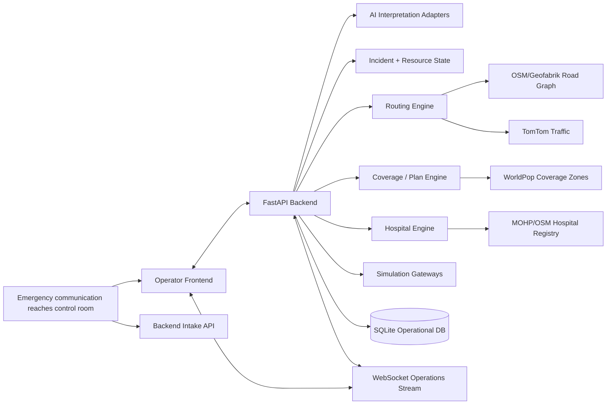

# SirenGrid — Technical Architecture & Implementation Plan v1.1

> **Status:** TECHNICALLY LOCKED FOR IMPLEMENTATION — v1.1  
> **Product authority:** `docs/MASTER_PLAN.md` v1.2 remains the product source of truth.  
> **Purpose:** Translate the locked SirenGrid product behavior into an implementation-ready software architecture, technical stack, module boundaries, data contracts, algorithms, runtime flows, tests, and execution plan.  
> **MVP geography:** Nasr City, Cairo  
> **Initial working/demo corridor:** Rabaa → Tayaran Street → Abbas El Akkad → Makram Ebeid → El Nasr Road  
> **Primary user:** Emergency Control Room Operator / Dispatcher  
> **Repository:** `MahmoudNagiubX/SirenGrid`  
> **Revision v1.1:** Applies the owner-approved architecture review: Golden-Flow-first delivery, single-worker MVP runtime, corrected routing/turn-restriction claims, progressive TomTom mapping, benchmark-gated AI providers, explicit prototype response rules, safer activation/hospital semantics, non-linear operational substates, corrected coding-agent workflow, early AI feasibility gates, frontend-owner deferral, and additional concurrency/reliability safeguards.

---

# 0. Executive Technical Summary

SirenGrid will be implemented as a **Python/FastAPI modular monolith**. The exact frontend stack is **not technically locked in this revision** and remains under frontend-owner review; the backend/API/map contracts must remain frontend-agnostic enough for that owner to choose or replace the frontend implementation without changing SirenGrid's operational contract.

The backend owns all operational truth and deterministic decision logic. AI is used only for interpretation, multimodal evidence understanding, semantic correlation support, and controlled explanation; it never fabricates routes, ETAs, responder state, hospital load, coverage, or critical operational outcomes.

The system uses a real Nasr City road graph derived from OpenStreetMap/Geofabrik, real live TomTom traffic where available and confidently mapped, WorldPop population data for coverage analysis, official/public hospital data for static facility information, and explicitly simulated operational state for responder GPS/status, live hospital load, traffic-signal state, corridor actuation, driver-alert delivery, and hospital acknowledgement.

The MVP runtime is intentionally **one backend instance / one backend worker**. Do not run multiple Uvicorn/Gunicorn workers for the hackathon MVP because WebSocket connection state, in-memory graph state, and runtime coordination are intentionally local to one process. Horizontal scaling is deferred.

Core closed loop:

**Control-room input → evidence interpretation → activation evaluation → incident state → candidate response plans → coverage simulation → human approval → traffic-aware route → simulated corridor/driver alert → hospital ranking/pre-alert → event-driven replanning → explanation/audit**

The implementation priority is an **integrated working Golden Flow first**. Lower-priority depth is added only after the runnable end-to-end system is stable.

# 1. Architecture Goals

The architecture must optimize for:

1. **Preserve the full Master Plan product contract while implementing in prioritized phases.** The Golden Flow and P0/P1 behavior take precedence over lower-priority depth so the system becomes and remains runnable end-to-end.
2. **Fast implementation in a hackathon timeline.**
3. **Real deterministic logic behind routing, coverage, scoring, plan comparison, and replanning.**
4. **Explicit real-vs-simulated boundaries.**
5. **Stable frontend/backend contracts so parallel development is possible.**
6. **Minimal unnecessary infrastructure.**
7. **Strong auditability, provenance, freshness, and human override.**
8. **Easy reuse of proven code from existing repositories.**
9. **A deterministic, replayable benchmark/demo mode.**
10. **Avoid hardcoding decisions that unnecessarily block later expansion to Greater Cairo or real integrations, without adding infrastructure solely for future scale.**

# 2. Locked Architectural Principles

## A1 — Modular Monolith

Use one backend application with clearly separated modules. Do not use microservices, Kafka, Redis, Celery, Kubernetes, CQRS, or a distributed event bus for the MVP.

Reason: all core subsystems share state heavily, the team is small, the timeline is short, and a single process gives the least integration risk.

**MVP runtime rule:** one backend instance / one backend worker. Do not start multiple application workers unless this architecture is explicitly revised to externalize shared runtime state.

## A2 — Backend Is the Operational Source of Truth

The frontend displays state and sends user actions. It must not independently calculate:

- operational ETA,
- coverage,
- hospital ranking,
- responder availability,
- plan score,
- replanning decisions,
- incident confidence,
- simulated external-action success.

## A3 — Deterministic Core, AI at the Edges

Deterministic code calculates:

- routing,
- travel-time metrics,
- resource eligibility,
- plan generation,
- coverage,
- hospital ranking,
- corridor geometry/timing,
- alert geofence,
- freshness,
- state transitions,
- benchmark metrics.

AI handles:

- Egyptian Arabic speech/text interpretation,
- image evidence interpretation,
- structured extraction,
- semantic duplicate/report matching support,
- concise explanation/paraphrasing based only on calculated facts.

## A4 — All Important Data Carries Reality + Provenance

Dynamic/operational data must be traceable to:

`REAL_PUBLIC | REAL_LIVE | REAL_DERIVED | SIMULATED | SYNTHETIC`

and include source, last-updated time, freshness, and source reference where applicable.

## A5 — Human Approval Is a State Transition

Approval is not a visual button only. It creates an auditable backend state transition and locks the approved plan version as the currently active plan.

Critical commands must also reject stale or already-consumed plan/state versions rather than silently applying the same action twice.

## A6 — Simulation Is an Adapter, Not Fake UI State

Responder GPS, hospital live load, traffic-light control, driver-alert delivery, and hospital acknowledgement are implemented through explicit simulation gateways. They generate real state changes inside SirenGrid while clearly identifying the external side as simulated.

## A7 — Replanning Is Event-Driven

Material state changes call the replanning evaluator. The system does not depend on an AI agent periodically “thinking” about whether to replan.

AI may interpret an incoming update into structured facts or explain a replan, but deterministic state/events decide when recalculation is required.

## A8 — One Stable API Contract

Frontend and backend work in parallel against versioned Pydantic/JSON contracts. Contract changes that affect another developer require review before merge.

The exact frontend technology may change during frontend-owner review without changing these backend contracts.

## A9 — Golden Flow First / Integrated Vertical Slices

Implementation must prioritize an end-to-end working system over isolated feature completion.

Every major phase should preserve or extend a runnable integrated flow. Golden Flow and P0/P1 behavior take precedence over lower-priority features. A subsystem is not considered useful merely because its isolated code exists if the system cannot exercise it through a real integration path.

# 3. Selected Technical Stack

## Backend

- **Language:** Python 3.12
- **API framework:** FastAPI
- **Validation/contracts:** Pydantic v2
- **ORM/persistence:** SQLAlchemy 2.x
- **MVP operational database:** SQLite with WAL mode
- **HTTP client:** httpx
- **Tests:** pytest
- **Formatting/lint:** Ruff

### Why SQLite for the MVP

The operational dataset is small, the app runs as one backend instance/worker, and geospatial routing is handled by the in-memory OSM graph rather than database spatial queries. SQLite avoids database-server setup while preserving transactional state and audit history.

The schema should remain portable enough to migrate to PostgreSQL/PostGIS later if the project expands, but no migration infrastructure should be added solely for future scale during the MVP.

## Geospatial / Routing

### Runtime / routing
- OSMnx
- NetworkX
- Shapely
- pyproj

### Preprocessing
- GeoPandas

### Storage / exchange
- GraphML for the processed routable graph
- GeoJSON as the primary frontend/API map-layer exchange format
- GeoParquet is **optional** only if it provides a concrete preprocessing/storage benefit; it is not a mandatory MVP format.

## Live Traffic

- TomTom Traffic Flow API
- TomTom Traffic Incidents API
- backend cache with timestamp/freshness metadata to avoid rate-limit waste
- traffic-to-OSM matching starts **route/corridor-focused** and expands toward broader Nasr City coverage only after the integrated flow is reliable

TomTom remains the primary real-live traffic provider for the MVP, but SirenGrid must remain operational if TomTom is unavailable or if a segment cannot be mapped with sufficient confidence.

## Frontend — OWNER REVIEW REQUIRED / NOT TECHNICALLY LOCKED

The v1.0 frontend stack proposal is **not approved by this architecture review**. The frontend owner may keep, replace, or simplify the framework, styling system, state library, test stack, and map implementation.

Any frontend choice must preserve these constraints:

- backend remains the operational source of truth,
- consumes the versioned REST/JSON contracts,
- supports live updates with a recoverable REST refresh path,
- does not independently calculate operational ETA/coverage/plan/hospital decisions,
- can render the map/route/zone contracts the backend exposes,
- keeps simulation/reality/freshness labels visible where required.

When the frontend owner approves an exact stack, record it separately in `docs/DECISIONS.md`.

## Realtime

- Native FastAPI WebSocket endpoint
- single in-process connection manager
- no Redis for the MVP
- REST remains the recovery/query source; WebSocket is never the only way to reconstruct current state

## AI / ML

Use provider interfaces so model/provider changes do not touch the deterministic core.

### Current provider configuration — benchmark-gated

The following is the **initial implementation configuration**, not a product-level dependency. It may be swapped through configuration after the Day-1 benchmark gate.

#### Speech-to-text
Interface: `SpeechToTextProvider`

- **Primary:** Groq `whisper-large-v3`
- **Fast fallback:** Groq `whisper-large-v3-turbo`
- **Local resilience candidate:** `faster-whisper`, enabled only after hardware/latency validation
- **Manual fallback:** operator can enter/correct the transcript if ASR/provider processing fails

Reasoning: emergency speech is error-sensitive, so the more accurate multilingual Whisper model is the initial primary. The Turbo model is available when lower latency is more valuable.

Evaluation:
- Egyptian-ASR-MGB-3,
- SirenGrid team-created Egyptian emergency-call evaluation set.

#### Structured incident interpretation
Interface: `IncidentInterpreter`

Initial configuration:
- **Default primary:** Groq `qwen/qwen3.8-27b`
- **Secondary text reasoning candidate:** Groq `openai/gpt-oss-120b`
- **Cross-provider fallback:** the latest suitable Gemini Flash model available within the project's active quota (current candidate at review time: `gemini-3.8-flash`)
- **Local fallback candidate:** the user's local Qwen3.5-4B, enabled only after latency/schema-quality validation

Day-1 benchmark must compare at least the Qwen primary candidate and GPT-OSS secondary candidate on SirenGrid Egyptian emergency examples. The architecture allows the config roles to swap if measured extraction quality is better.

Behavior:
- input transcript/text + optional evidence references,
- output strict structured JSON using provider JSON Schema / constrained structured output when supported, then validate again with Pydantic,
- normal extraction uses non-thinking/instruct mode where supported to reduce tokens/latency,
- reasoning mode is reserved for genuinely complex/conflicting evidence,
- unknown values must be `null`/unknown,
- no operational route/resource/hospital decisions are produced by the model,
- on invalid schema: allow **one controlled retry/reformat attempt**, then fail visibly to operator/manual fallback,
- bounded timeout/retry/backoff only; no infinite retries.

#### Image evidence
Interface: `VisionEvidenceInterpreter`

Initial configuration:
- **Primary:** Groq `qwen/qwen3.8-27b`
- **Cross-provider fallback:** suitable Gemini Flash vision capability within active project quota

Because the Groq Qwen model is a preview model, the demo must include a pre-demo provider health check and working fallback path.

Behavior:
- describe operationally relevant visible evidence,
- identify possible fire/smoke/vehicle damage/road obstruction only when supported,
- never create patient diagnosis,
- preserve image as evidence with source metadata,
- never infer authoritative incident coordinates from image/text alone.

#### Semantic similarity
Use a local multilingual sentence embedding model suitable for Arabic, e.g. multilingual E5 family.

The **exact embedding checkpoint is benchmark-gated** on the team-created report-fusion evaluation set and is not locked by this document.

Used for:
- report semantic similarity,
- not for autonomous dispatch.

### Provider/quota resilience rules

- no free-tier numeric quota is hardcoded as an architectural guarantee,
- check active account/provider quotas before the hackathon/demo,
- handle `429`/provider timeout explicitly with bounded retry/backoff,
- log provider/model used for each AI artifact,
- preserve raw input so failed AI work can be replayed,
- AI provider outage must not corrupt deterministic state.

## Deployment

**Local-first is locked for the MVP.**

- backend and frontend run locally during development/demo preparation,
- deployment must not become a prerequisite for the Golden Flow,
- containerization/hosting/cloud provider remain deferred until needed,
- if public deployment is chosen, add the minimum required access controls for write/admin/simulation endpoints.

Do not design the architecture around a particular cloud provider.

# 4. System Context Diagram



---

# 5. Runtime Component Architecture

```text
frontend/
    Operator Web App
        ├── Incident Queue
        ├── Incident Detail / Corrections
        ├── Operational Map
        ├── Plan Comparison
        ├── Approval Controls
        ├── Hospital Panel
        ├── Timeline / Freshness
        └── Scenario Controls (demo/admin only)

backend/
    FastAPI App
        ├── API / WebSocket Layer
        ├── Incident Domain
        ├── Intake + AI Interpretation
        ├── Resource State
        ├── Routing + Traffic
        ├── Coverage
        ├── Response Planning
        ├── Hospital Ranking
        ├── Corridor + Driver Alert
        ├── Replanning
        ├── Freshness / Provenance
        ├── Timeline / Audit
        ├── Simulation Runtime
        └── Benchmark Runner

persistent/state assets
    ├── SQLite runtime database
    ├── GraphML road graph
    ├── GeoJSON/GeoParquet map/zone layers
    ├── scenario JSON fixtures
    └── uploaded demo evidence files
```

---

# 6. Proposed Repository Structure

Keep this structure compact. Only create a file when its responsibility is real.

```text
SirenGrid/
├── backend/
│   ├── app/
│   │   ├── main.py
│   │   ├── config.py
│   │   ├── db.py
│   │   ├── schemas.py
│   │   ├── incidents.py
│   │   ├── intake.py
│   │   ├── resources.py
│   │   ├── routing.py
│   │   ├── coverage.py
│   │   ├── planning.py
│   │   ├── hospitals.py
│   │   ├── operations.py
│   │   ├── simulation.py
│   │   └── websocket.py
│   ├── tests/
│   └── requirements.txt
├── frontend/
│   ├── src/
│   │   ├── api/
│   │   ├── components/
│   │   ├── features/
│   │   ├── map/
│   │   ├── App.tsx
│   │   └── main.tsx
│   └── package.json
├── data/
│   ├── raw/
│   ├── processed/
│   ├── evaluation/
│   ├── scenarios/
│   └── README.md
├── docs/
│   ├── MASTER_PLAN.md
│   ├── DECISIONS.md
│   └── TECHNICAL_ARCHITECTURE.md
├── AGENTS.md
├── CONTRIBUTING.md
└── README.md
```

### Important structure rule

The tree above is a **target/reference structure, not an instruction to scaffold every file or folder immediately**.

Create a file/directory only when its responsibility actually exists in the current phase. Do not create placeholder modules merely to match the diagram.

Do not split each small function into a separate service/repository/helper file. Reuse an existing focused module cleanly when possible. Split a module only when it becomes genuinely too large or contains two clearly separate responsibilities.

---

# 7. Core Domain Model

## Incident

Core fields:

```text
id
incident_type
severity
confidence_level
status
latitude
longitude
location_text
casualty_count / casualty_range
trapped_person
road_blockage
required_services
current_plan_id
created_at
updated_at
```

Important rules:
- unknown is represented explicitly, never fabricated,
- severity and confidence are separate,
- operator correction records provenance/history,
- incident may become ACTIVE while details are incomplete.

## Report

```text
id
incident_id nullable until fusion decision
source_type
source_reference
raw_text/transcript
location metadata
received_at
data_reality
processing_status
```

## Evidence Item

Can be stored as report-linked JSON metadata for the MVP:

```text
type: transcript | image | location | operator_entry | responder_update | hospital_update
uri/path/reference
extracted_facts
provenance
confidence/support
created_at
```

## Emergency Resource

```text
id
resource_type
capability_tags
status
latitude
longitude
home_zone
assigned_incident_id
last_updated
source
freshness_status
data_reality = SIMULATED for MVP operational state
```

Allowed status values:

`AVAILABLE | RESERVED | ASSIGNED | EN_ROUTE | ON_SCENE | TRANSPORTING | OUT_OF_SERVICE`

## Hospital

```text
id
name
latitude
longitude
static_capabilities
static_capacity
simulated_free_capacity
simulated_load
accepting_state
incoming_cases
last_updated
source/freshness/data_reality
```

Static published capacity and simulated live availability must never be conflated.

## Response Plan

```text
id
incident_id
version
status: CANDIDATE | RECOMMENDED | APPROVED | REJECTED | SUPERSEDED
resource_assignments_json
routes_json
coverage_snapshot_json
hospital_option_json
corridor_plan_json
alert_region_json
metrics_json
score_breakdown_json
explanation_facts_json
created_at
```

## Approval — F12

```text
id
plan_id
action
operator_reference
reason optional
created_at
```

## Timeline Event — F16

Append-only operational history:

```text
id
incident_id
event_type
actor_type
payload_json
created_at
```

No event is silently deleted when current state changes.

---

# 8. Persistence Strategy

Use SQLite for mutable operational state. Do not store large geospatial data or media blobs inside the database.

## SQLite stores

- incidents,
- reports/evidence metadata,
- resources and mutable operational state,
- hospitals and mutable simulated load,
- response plans,
- approvals,
- timeline events,
- selected traffic/freshness snapshots when persistence is useful.

## Files store

- GraphML road graph,
- GeoJSON/GeoParquet layers,
- population aggregation,
- benchmark scenarios,
- evaluation datasets/metadata,
- uploaded synthetic/demo audio/images.

## Transaction rules

Critical state transitions must be transactional where possible:

- approve plan + assign resources,
- reject/supersede plan,
- manual incident correction + timeline event,
- resource unavailability + affected-plan marker.

Resource status must not be updated separately from plan approval in a way that allows double assignment.

---

# 9. Data Acquisition & Processing Architecture

The locked data list is implemented as reproducible preprocessing, not ad-hoc manual edits.

## Phase D1 — Geospatial Base

Sources:
- existing Nasr City assets from `Egypt-Smart-City-Digital-Twin`,
- Geofabrik Egypt OSM extract,
- Overpass API for signals/hospitals/stations/POIs.

Processing:
1. clip Egypt OSM extract to the Nasr City MVP boundary,
2. build directed driving graph,
3. preserve one-way and access restrictions supported by the processed graph,
4. treat OSM turn-restriction relations as a separate capability: apply them only if explicitly processed and validated; otherwise do **not** claim turn-restriction compliance,
5. add speed and base travel-time attributes,
6. extract traffic signals and important intersections,
7. export GraphML + frontend-ready GeoJSON.

The older road data is bootstrap/reference only; final road graph is refreshed from current OSM/Geofabrik.

## Phase D2 — Population Coverage

Source:
- WorldPop Egypt 2025 constrained 100 m.

Processing:
1. clip raster/cells to Nasr City,
2. spatially aggregate population into the existing 500 m operational zones,
3. store `zone_id`, geometry, centroid, population,
4. mark as REAL_DERIVED with WorldPop source reference.

## Phase D3 — Hospital Registry

Sources:
- MOHP official/public hospital records,
- OSM/Overpass location cross-check.

Processing:
1. normalize hospital name/location,
2. retain source-specific static capacity/capability where available,
3. never transform static capacity into live free capacity,
4. seed simulated current load separately.

## Phase D4 — Traffic

TomTom client returns traffic snapshots with:

```text
current_speed
free_flow_speed
current_travel_time
free_flow_travel_time
road_closure / incident state
last_updated
```

Snapshots are cached with TTL and mapped to nearby graph edges.

Fallback if TomTom is unavailable:
- keep last known snapshot but mark STALE, or
- use base OSM travel time with explicit stale/unavailable traffic status.

Do not silently pretend traffic is live.

## Phase D5 — AI / Evaluation Data

- Egyptian-ASR-MGB-3: ASR evaluation only.
- CrisisMMD: image/multimodal evaluation only.
- SirenGrid Egyptian Emergency Call Dataset: team-created emergency-specific test set.
- CAPMAS accident/fire statistics: calibrate scenario distributions, not live incident generation.

---

# 10. Routing Engine — F05/F06/F15

## 10.1 Graph

Use an OSMnx `MultiDiGraph` representing drivable Nasr City roads.

Each edge should include, where available:

```text
length_m
highway_type
oneway
speed_kph
base_travel_time_s
live_traffic_factor
closure_state
access_restriction_state
turn_restriction_support_status
last_traffic_update
```

## 10.2 Effective Weight

Conceptually:

```text
if edge is CLOSED:
    edge unavailable
else:
    effective_time = base_travel_time_s × traffic_factor + simulated_signal_delay
```

Rules:
- `traffic_factor` comes from a captured TomTom/fallback traffic snapshot.
- `simulated_signal_delay` is **zero unless the scenario explicitly enables a simulated signal-delay/corridor model**.
- any simulated signal-delay reduction must remain labeled simulated in metrics/explanations.
- one-way/access restrictions are required when represented by the graph.
- turn restrictions are enforced only if the route engine has explicitly processed and validated them; otherwise SirenGrid must not claim turn-restriction compliance.

Do not invent exact speed when a live source is missing.

## 10.3 Route Calculation

Inputs:
- current resource coordinate,
- destination coordinate,
- current graph/traffic snapshot.

Steps:
1. validate coordinate within service area,
2. snap origin/destination to nearest valid graph nodes,
3. calculate fastest feasible route,
4. generate 1–2 alternatives when useful,
5. calculate distance + ETA + affected roads,
6. return frontend-ready route geometry (GeoJSON or the agreed map contract).

Reuse/adapt proven route code from the user's existing smart-city repository instead of rebuilding OSMnx fundamentals from scratch.

## 10.4 Alternative Routes

Use k-shortest/alternative path search with overlap filtering so the alternatives are meaningfully different rather than trivial variants.

## 10.5 Route Replanning

Trigger route recalculation when:
- active-route edge closes,
- traffic ETA degrades materially,
- destination changes,
- resource current position deviates materially,
- operator changes incident location/road constraint.

Thresholds are configuration values, not hardcoded product claims.

---

# 11. Traffic Overlay Strategy

TomTom data must not force a complete rebuild of the graph every request.

Recommended flow:

1. maintain the **base OSM graph as effectively immutable runtime geometry/topology**,
2. refresh TomTom traffic snapshots periodically/on-demand,
3. map TomTom segments/incidents onto nearby OSM edges through an isolated matching adapter,
4. store traffic as a **versioned overlay/snapshot** keyed to graph edges rather than mutating shared graph truth in-place,
5. store mapping confidence/quality where relevant,
6. ignore or fall back for low-confidence/unmatched traffic segments instead of applying uncertain traffic to the wrong edge,
7. preserve timestamp and freshness,
8. active routes reference the exact traffic snapshot/version they were generated from.

Routing/coverage calculations capture one traffic snapshot at the beginning of a calculation so a concurrent refresh cannot change weights halfway through the same result.

Cache requests to protect API allowance.

### Progressive MVP depth

1. make matching reliable on the primary demo corridor and route-relevant edges,
2. expand toward broader Nasr City mapping while time allows,
3. never block the Golden Flow waiting for perfect city-wide segment matching.

If only part of Nasr City has fresh TomTom data, mixed-state routing is allowed as long as the resulting explanation/freshness indicates which traffic source is current vs fallback.

# 12. Coverage Engine — F10

Coverage is one of SirenGrid's defining technical differentiators.

## 12.1 Inputs

- operational zones,
- population per zone,
- current available resources,
- resource capabilities/type,
- road graph + travel times,
- configurable prototype target response time.

The target must be identified as a prototype/benchmark parameter unless sourced from an approved official standard.

## 12.2 Algorithm

For each eligible resource:
1. snap current location to graph,
2. run single-source Dijkstra travel-time calculation,
3. record ETA to every zone centroid.

For every zone:

```text
zone_eta = minimum ETA from an eligible AVAILABLE resource
covered = zone_eta <= configured_target
```

Metrics:

```text
population_weighted_coverage =
  population in covered zones / total modeled population

worst_zone_eta = max(zone_eta)
undercovered_zone_count = count(not covered)
```

## 12.3 Dispatch Simulation

For every candidate plan:
1. remove candidate assigned resources from general availability,
2. recompute coverage,
3. compare against baseline coverage,
4. identify the most affected zones.

## 12.4 Repositioning

If coverage drops materially:
1. find available reserve resources,
2. generate candidate repositioning locations (zone centroid/base point),
3. simulate each move,
4. choose repositioning that improves coverage with acceptable travel/reposition cost,
5. include it in the candidate response plan, not as hidden behavior.

No resource repositions until the plan is approved.

---

# 13. Resource Assignment & Candidate Plan Generator — F09/F11/F19

## 13.1 Response Requirements

The planner receives an explicit `ResponseRequirements` structure:

```text
required resource types
minimum counts
required capability tags if known
priority/severity context
transport requirement if known
```

Requirements may come from:
- explicit source information,
- operator confirmation,
- an approved **SirenGrid Prototype Response Requirement Matrix**.

### Prototype Response Requirement Matrix

A small explicit rules matrix will be created during implementation for supported MVP/demo incident patterns.

Example shape only:

```text
incident pattern → required resource types/counts/capabilities
```

Rules:
- the matrix is **prototype configuration**, not official Egyptian emergency-service doctrine,
- every rule is reviewable and testable,
- an LLM must not invent or dynamically change response doctrine,
- if no approved rule applies and source/operator information is insufficient, the system asks for operator confirmation rather than inventing requirements.

The exact matrix values are implementation decisions to be reviewed before demo use.

## 13.2 Resource Filtering

A resource is eligible only if:
- state allows assignment,
- capability matches,
- it is not committed to another active incident,
- a feasible route exists.

Never use the ResQPath-style fallback of assigning a resource regardless of current status.

## 13.3 Candidate Generation

To keep search tractable:
1. identify top N eligible responders per required type by ETA,
2. generate valid combinations,
3. simulate each combination,
4. prune infeasible plans,
5. optionally generate reserve/reposition variations.

## 13.4 Candidate Metrics

Each plan calculates:

- primary incident ETA,
- responder arrival spread,
- route feasibility,
- population-weighted coverage after dispatch,
- worst-zone ETA,
- zones below target,
- repositioning cost,
- resource reserve state,
- hospital score if transport destination is already relevant.

## 13.5 Plan Ranking

Use hard constraints first, then a transparent normalized objective score.

Conceptual form:

```text
plan_score =
    w_eta * normalized_incident_eta
  + w_coverage * coverage_penalty
  + w_reserve * resilience_penalty
  + w_reposition * reposition_penalty
  + w_hospital * hospital_penalty
```

Lower can represent better cost, or higher can represent utility; choose one convention and keep it consistent.

Weights must live in explicit configuration and the score breakdown must be stored with the plan.

Until benchmarked/calibrated, weights must be labeled **prototype weights** rather than evidence of an official dispatch policy.

Do not let an LLM choose weights dynamically.

---

# 14. Hospital Selection — F13/F14

## 14.1 Hard Filters

Before scoring, remove hospitals that are:
- explicitly modeled unavailable/not accepting,
- **confirmed incompatible** with a required known capability,
- unreachable by the road graph.

Important distinction:
- `confirmed capability missing/incompatible` → hospital may be filtered out,
- `capability unknown/not available in the dataset` → do **not** treat as confirmed incompatibility; lower confidence / mark uncertainty / request operator review where necessary.

Missing public data must never be silently converted into a negative capability fact.

## 14.2 Ranking Inputs

- route ETA,
- static capability/specialty,
- static published capacity if available,
- simulated current free capacity/load,
- incoming cases,
- data freshness.

## 14.3 Score

Normalize each metric to a common range and record every term.

Conceptual form:

```text
hospital_utility =
    w_eta * eta_score
  + w_capability * capability_score
  + w_capacity * capacity_score
  + w_load * load_score
  + w_freshness * freshness_score
```

A stale critical operational value lowers trust and may require operator confirmation.

## 14.4 Pre-Alert

After destination approval, generate a structured message containing only known facts:

- receiving hospital,
- incoming unit,
- incident category,
- patient/casualty count if known,
- severity/priority,
- ETA,
- known operational preparation needs.

Delivery is handled by `HospitalGateway`.

MVP implementation uses `SimulatedHospitalGateway` and labels acknowledgement as simulated.

---

# 15. Emergency Corridor — F07

## 15.1 Corridor Extraction

Given an approved route:
1. get route polyline/nodes,
2. find OSM traffic signals/intersections within a small route buffer,
3. order them by distance along route,
4. calculate estimated vehicle arrival time to each intersection.

## 15.2 Simulated Priority State

Each relevant signal/corridor segment has a state such as:

`NORMAL | REQUESTED | PREPARING | PRIORITY_ACTIVE | PASSED | FAILED`

## 15.3 Timing

Conceptual priority request time:

```text
request_time = estimated_intersection_arrival - safety_lead_time
```

Safety lead time is a configurable simulation parameter, not an official Cairo traffic-controller value.

## 15.4 Route Impact

If the simulation models signal delay reduction, that reduction must be explicit in route/corridor metrics and labeled simulated.

If corridor activation fails:
- route remains valid,
- ETA may worsen,
- planner may consider another route.

---

# 16. Clear-the-Way Driver Alert — F08

The backend computes a real geographic target area even though delivery is simulated.

Algorithm:
1. locate emergency vehicle on active route,
2. take the route section N meters ahead,
3. create a narrow buffer/geofence around the forward route segment,
4. return polygon + expiry time,
5. update it as the vehicle progresses,
6. expire sections already passed.

The system stores:
- alert region,
- active vehicle,
- route/incident,
- created/expires time,
- simulated delivery state.

No patient or private incident details are included.

---

# 17. Multimodal Intake — F01/F02/F04

## 17.1 Control-Room Boundary

There is no citizen SirenGrid reporting app.

Inputs arrive via:
- operator-entered text,
- emergency-call audio/transcript available to the control room,
- caller location metadata,
- image/video evidence forwarded through an authorized channel,
- responder/hospital updates.

## 17.2 Processing Pipeline

```text
Input received
  ↓
Preserve raw report/evidence + source metadata
  ↓
Speech-to-text if audio
  ↓
Structured AI extraction
  ↓
Pydantic validation
  ↓
Known / unknown field representation
  ↓
Deterministic activation evaluator / operator confirmation when required
  ↓
Incident activation/update
  ↓
Report fusion check
  ↓
Plan generation/replanning if operationally relevant
```

### Activation authority rule

AI may classify/extract urgency indicators, but the LLM is **not the sole authority gate** for whether SirenGrid creates/activates an incident.

Activation uses explicit backend rules derived from the Master Plan's immediate-response rule plus operator confirmation when required by missing/ambiguous inputs.

A single credible urgent report received by the control room must remain sufficient to activate the response workflow; the system must never require duplicate reports as a dispatch gate.

## 17.3 Structured Interpretation Schema

Example fields:

```json
{
  "incident_type": "road_crash",
  "location_text": "Abbas El Akkad",
  "latitude": null,
  "longitude": null,
  "severity": "high",
  "casualty_count": null,
  "trapped_person": true,
  "road_blockage": null,
  "required_services": ["ambulance", "rescue"],
  "missing_critical_fields": ["exact_location", "casualty_count"],
  "evidence_refs": ["report:123"],
  "support_level": "medium"
}
```

The exact interpretation must never fabricate unknown fields.

`latitude` / `longitude` may only become authoritative incident coordinates from explicit source metadata, operator input/map click, or deterministic location resolution/geocoding. A language/vision model must not invent coordinates for a landmark name.

## 17.4 Location Resolution

Location can come from:
- explicit lat/lon metadata,
- operator map click,
- deterministic landmark/place lookup from local OSM POIs,
- text geocoding/search.

If location remains ambiguous, routing must stay blocked and operator sees `location required`.

Location-resolution candidates may be shown to the operator, but ambiguity must not be hidden by snapping to a convenient place.

---

# 18. Report Fusion / Duplicate Detection — F03

Use a combined deterministic + semantic score.

## Candidate Filtering

Only compare against incidents that are:
- still active/recent,
- geographically plausible,
- temporally plausible.

## Signals

- geographic distance,
- time difference,
- incident-type compatibility,
- multilingual semantic embedding cosine similarity,
- shared road/landmark clues,
- visual/context similarity if available.

## Outcome Bands

- high confidence same incident → attach automatically and record why,
- ambiguous → operator review,
- low similarity → create separate incident.

Thresholds are technical configuration and must be tested on the team-created evaluation set.

Earlier evidence is preserved. Fusion never overwrites history.

---

# 19. Confidence / Evidence Model — F04

Do not present arbitrary model logits as a survival probability or exact truth probability.

Recommended operator-facing confidence:

`LOW | MEDIUM | HIGH`

Confidence/support derives from evidence quality and corroboration, for example:
- explicit operator-confirmed fact → high support,
- multiple independent compatible evidence items → stronger support,
- single clear transcript → medium,
- ambiguous ASR/extraction or conflicting reports → low/review.

Each material fact should expose:
- current value,
- source/provenance,
- confidence/support,
- last updated,
- whether operator corrected it.

---

# 20. Human Correction — F17

Endpoint/UI edits current incident facts while preserving history.

Required backend sequence:

1. validate edit,
2. capture old value,
3. write new value with `operator_corrected` provenance,
4. append timeline event,
5. mark downstream plan inputs dirty,
6. recalculate route/coverage/hospital/plan if affected,
7. notify frontend with old/new consequence if material.

Later AI processing must not silently overwrite an operator-corrected fact.

---

# 21. Freshness / Staleness — F18

Every operational source has a freshness policy configured centrally.

Examples:
- TomTom traffic: short TTL,
- responder simulated GPS: short TTL,
- hospital simulated load: medium TTL,
- OSM geometry: static,
- MOHP static capacity: static/dated,
- operator-entered incident fact: current until superseded.

Each important value carries:

```text
source
data_reality
last_updated
freshness_status
source_reference
```

If a value is stale:
- mark it visibly,
- do not silently refresh timestamp,
- recommendation may include a stale-data warning,
- critical stale value can require operator confirmation.

---

# 22. Multi-Incident Resource Contention — F19

The backend resource table is shared across all incidents.

When Incident B appears:
1. already assigned resources remain unavailable,
2. available resource pool recalculates,
3. coverage recalculates,
4. affected active plan is checked for resilience,
5. if a new candidate reallocation is useful, show trade-off,
6. unresolved priority conflict escalates to operator.

The system must never silently cancel Incident A or steal its resource for Incident B.

No complex autonomous ethical triage engine is implemented.

---

# 23. Replanning Orchestrator — F15

Replanning is a deterministic orchestration layer.

## Trigger Events

- `TRAFFIC_CHANGED`
- `ROAD_CLOSED`
- `RESOURCE_UNAVAILABLE`
- `HOSPITAL_STATE_CHANGED`
- `INCIDENT_FACT_CHANGED`
- `SECOND_INCIDENT_ACTIVATED`
- `OPERATOR_CONSTRAINT_CHANGED`

## Sequence

```text
State change
  ↓
Determine affected incidents/plans
  ↓
Recalculate only affected subsystems
  ↓
Generate Plan vN+1
  ↓
Compare current approved plan vs candidate
  ↓
If material change: mark current plan affected
  ↓
Send recommendation + reason to operator
  ↓
Human approval required for material operational change
```

A replan never silently replaces the approved plan.

High-frequency source updates (for example repeated traffic refreshes or vehicle-position ticks) must be **coalesced/debounced by materiality** so SirenGrid does not generate a new plan version for insignificant noise.

---

# 24. Explainability Architecture

Explanations are built from stored calculation facts first.

Example structured explanation input:

```json
{
  "chosen_resource": "A4",
  "chosen_eta_sec": 345,
  "alternative_resource": "A2",
  "alternative_eta_sec": 310,
  "coverage_if_A2": 0.41,
  "coverage_if_A4": 0.72,
  "undercovered_zone": "Zone C"
}
```

A deterministic template can directly generate:

> A4 is recommended although it is 35 seconds slower because using A2 would reduce modeled Zone C coverage from 72% to 41%.

An LLM may paraphrase this for natural language but is not allowed to introduce any new factual reason or number.

---

# 25. Incident Lifecycle State Machine

Use explicit backend transitions for the **main incident lifecycle**.

```text
RECEIVED
→ INTERPRETING
→ ACTIVE_UNCONFIRMED
→ RESPONSE_PROPOSED
→ AWAITING_APPROVAL
→ RESPONSE_ACTIVE
→ EN_ROUTE
→ ON_SCENE
→ TRANSPORT_ACTIVE (if applicable)
→ HANDOVER
→ CLOSED
```

Additional incident states:

`REQUIRES_REVIEW | DUPLICATE_MERGED | CANCELLED_FALSE_REPORT`

### Parallel operational substates/events

The following are **not forced linear incident lifecycle states** because they may occur before, during, or independently of transport progression:

- hospital destination selected/approved,
- hospital pre-alert requested/sent/acknowledged,
- corridor requested/active/passed/failed,
- public clear-the-way alert active/expired,
- route/replan version changes.

These are modeled as dedicated domain states and/or timeline events linked to the incident/plan.

Transition rules live in backend code; frontend cannot assign arbitrary state strings.

# 26. Simulation Architecture

External operational integrations are represented behind clean gateways.

## Fleet Gateway

```text
get_resources()
get_resource_state(id)
set_simulated_status(id, status)
advance_vehicle_position(id, route_progress)
```

## Traffic Signal Gateway

```text
request_priority(corridor)
get_priority_state(intersection)
release_priority(intersection)
```

## Hospital Gateway

```text
get_operational_state(hospital_id)
send_prealert(payload)
get_acknowledgement(prealert_id)
```

## Public Alert Gateway

```text
publish_geofenced_alert(region, message, expires_at)
expire_alert(alert_id)
```

MVP adapters are explicitly named/marked simulated.

Scenario state is seedable and reproducible so a demo can be replayed exactly.

---

# 27. Demo / Scenario Engine

A scenario file defines the starting world and scheduled changes.

Example:

```json
{
  "id": "demo_crash_01",
  "seed": 42,
  "resources": [...],
  "hospitals": [...],
  "incident": {...},
  "scheduled_events": [
    {"at_sec": 45, "type": "ROAD_CLOSED", "road_id": "..."},
    {"at_sec": 70, "type": "NEW_EVIDENCE", "payload": {...}},
    {"at_sec": 100, "type": "SECOND_INCIDENT", "payload": {...}}
  ]
}
```

The scenario engine changes real backend state, not frontend-only display variables.

Demo controls may allow the operator/developer to trigger the same events manually.

---

# 28. Realtime Architecture

Use one WebSocket operations channel, e.g.:

`/api/v1/ws/operations`

Event envelope:

```json
{
  "event": "incident.updated",
  "incident_id": "INC-001",
  "timestamp": "...",
  "version": 17,
  "payload": {...}
}
```

Important event types:

```text
incident.created
incident.updated
report.attached
plan.generated
plan.approved
plan.rejected
route.updated
coverage.updated
resource.updated
hospital.updated
corridor.updated
alert.updated
replan.required
replan.generated
timeline.appended
freshness.changed
```

Frontend uses REST for initial/query state and WebSocket for live invalidation/updates.

Event/entity versions must be monotonic enough for the client to detect a missed/out-of-order update. If the client detects a version gap or reconnects, it re-fetches canonical REST state.

Do not make WebSocket the only way to retrieve state.

---

# 29. API Contract

Version prefix:

`/api/v1`

### Critical-command concurrency rule

Approval/rejection/replan commands must verify the current plan/incident version and legal state transition. Repeated or stale commands must return a clear conflict/idempotent result rather than double-assigning resources or reapplying the same action.

## Intake

```text
POST /intake/text
POST /intake/audio
POST /intake/image
POST /incidents/{id}/reports
```

## Incidents

```text
GET   /incidents
GET   /incidents/{id}
PATCH /incidents/{id}/facts
POST  /incidents/{id}/close
GET   /incidents/{id}/timeline
```

## Resources

```text
GET /resources
GET /resources/{id}
```

## Planning

```text
POST /incidents/{id}/plans/generate
GET  /incidents/{id}/plans
GET  /plans/{id}
POST /plans/{id}/approve
POST /plans/{id}/reject
POST /plans/{id}/recalculate
```

## Routing / Map

```text
GET  /map/boundary
GET  /map/roads
GET  /map/zones
GET  /map/hospitals
GET  /map/signals
POST /routes/preview
```

## Hospitals

```text
GET  /hospitals
GET  /incidents/{id}/hospital-options
POST /incidents/{id}/hospital-prealert
```

## Demo / Simulation

Keep these separate and clearly labeled:

```text
POST /simulation/reset
POST /simulation/load/{scenario_id}
POST /simulation/events
GET  /simulation/status
```

Production-facing UI must not confuse simulation controls with real operator functions.

---

# 30. Frontend Architecture — OWNER REVIEW REQUIRED

This section defines **required product information/behavior**, not a locked frontend framework or component architecture. The frontend owner may restructure the implementation while preserving these operator requirements and backend contracts.

## Primary Operator Screen

One operational workspace should contain:

### Left / Queue
- new/active incidents,
- severity,
- confidence,
- lifecycle state,
- freshness warnings.

### Center / Map
- incident,
- responders,
- roads,
- closures/congestion,
- selected/alternative route,
- coverage zones,
- hospitals,
- corridor,
- driver alert region.

### Right / Decision Panel
- incident summary,
- known/unknown facts,
- evidence/provenance,
- manual corrections,
- recommended plan,
- alternatives,
- ETA + coverage metrics,
- approval/reject/recalculate,
- hospital decision,
- replan warning.

### Bottom / Timeline
- reports,
- changes,
- approvals,
- route changes,
- pre-alert,
- closure/resolution.

## Secondary Views

### Responder View
Only:
- assignment,
- priority,
- incident location,
- route,
- ETA,
- route/corridor update.

### Hospital View
Only:
- incoming unit,
- ETA,
- incident category,
- patient/casualty count if known,
- severity/priority,
- known preparation information,
- simulated acknowledgement if enabled.

### Benchmark View
Developer/judge-oriented measured comparison, separate from the operator flow.

---

# 31. Frontend State Strategy — OWNER REVIEW REQUIRED

The exact frontend state library is not locked in v1.1. The frontend owner may retain or replace the v1.0 proposal.

Required invariant: operational/server state remains backend-owned; the client must have a REST recovery path after reconnect/version gaps.

**Previous candidate proposal (non-binding):** TanStack Query for REST/server state.

WebSocket events should invalidate/update relevant query cache entries rather than create a second independent source of truth.

Local UI state only:
- selected incident,
- panel visibility,
- selected candidate plan,
- map layer toggles,
- temporary operator form edits.

If Zustand or another client-state library is used, do not store operational truth only there.

---

# 32. Map Contract

Backend returns frontend-ready GeoJSON whenever possible.

Common feature properties:

```text
id
type
status
label
source
data_reality
freshness_status
```

Map layer IDs should be stable so route/corridor/coverage updates replace existing features rather than continuously create duplicates.

---

# 33. Data Reality & Provenance Contract

Canonical structure:

```json
{
  "source": "TomTom",
  "data_reality": "REAL_LIVE",
  "last_updated": "2026-09-06T12:00:00+03:00",
  "freshness_status": "LIVE",
  "source_reference": "traffic-flow-snapshot:..."
}
```

Allowed reality values:

```text
REAL_PUBLIC
REAL_LIVE
REAL_DERIVED
SIMULATED
SYNTHETIC
```

Allowed freshness values:

```text
LIVE
FRESH
STALE
STATIC
UNKNOWN
```

These enums should be shared in API schemas and rendered consistently in the frontend.

---

# 34. AI Failure Strategy

If AI fails:

- preserve the raw report/evidence,
- mark interpretation failed/unavailable,
- if operator already supplied structured incident data, deterministic planning may continue,
- never generate fake fallback severity or casualty values,
- show operator that AI processing failed,
- allow manual correction/entry.

If ASR fails, operator can enter/edit transcript manually.

---

# 35. Routing / Data Failure Strategy

## TomTom unavailable
- use base graph/last known data according to freshness rules,
- mark traffic source unavailable/stale,
- do not claim live traffic.

## Coordinate outside graph
- return explicit location/routing error,
- do not snap kilometres away and pretend it is valid.

## No path
- try valid alternatives,
- escalate to operator,
- do not draw a straight line as a real route.

## Hospital route failure
- hospital is infeasible for that plan.

---

# 36. Security / Privacy for Prototype

- no API keys in source code,
- `.env` excluded from Git,
- validate uploaded media size/type,
- sanitize filenames and generate internal IDs,
- do not require patient names for the demo,
- public driver alerts never contain private incident details,
- avoid storing real emergency caller personal data,
- use synthetic/team-created emergency recordings for demo/evaluation,
- restrict simulation/admin endpoints if the app is publicly deployed,
- MVP audit actions may use a configured synthetic/demo operator identity; do not build a full identity platform unless deployment requires it,
- if the app is publicly reachable, protect critical write/approval/admin endpoints with at least minimal authentication/authorization.

---

# 37. Benchmark / Evaluation Architecture

Baseline must be simple and reproducible.

## Baseline

1. nearest available eligible responder,
2. fastest current route,
3. nearest suitable hospital,
4. no coverage-aware repositioning,
5. no network-level multi-incident resilience optimization.

## SirenGrid

Same scenario inputs, but uses:
- candidate plan comparison,
- coverage preservation,
- repositioning,
- hospital load/capability,
- multi-incident resource state,
- dynamic replanning.

## Scenario Set

30–50 scenarios if feasible.

Vary:
- location,
- incident type/severity,
- casualty count,
- responder positions/status,
- road closure,
- congestion,
- hospital load/capability,
- second incident.

## Metrics

- report-to-structured-incident latency,
- first-plan latency,
- incident responder ETA,
- population-weighted coverage before/after,
- worst-zone ETA,
- hospital ETA/suitability,
- replanning latency,
- end-to-end workflow success,
- ASR WER/CER,
- structured extraction field accuracy/F1,
- report-fusion precision/recall on evaluation cases.

No improvement percentage is shown until actually measured.

---

# 38. Testing Strategy

## Unit Tests

Required for:
- state transitions,
- report fusion scoring,
- routing failure/closures,
- coverage math,
- candidate-plan pruning/ranking,
- hospital ranking,
- freshness status,
- manual correction behavior,
- multi-incident resource locking,
- corridor/alert geometry.

## API Integration Tests

Test complete backend flows with FastAPI TestClient/httpx.

## Frontend Tests

- critical panels render known/unknown/provenance correctly,
- approval controls call correct API,
- WebSocket events update/invalidate visible state,
- simulated labels are visible where required.

## E2E

At minimum one automated or reproducible scripted golden flow:

`intake → active incident → plans → coverage → approval → route → corridor → hospital → road closure → replan → explanation → close`

## Mandatory Master Plan Cases

T01–T15 from the Master Plan must each have a reproducible test or demo case.

---

# 39. Observability / Debugging

Keep it lightweight.

Backend logs should include:
- request/incident ID,
- plan version,
- route calculation duration,
- plan generation duration,
- traffic snapshot age,
- replan trigger,
- simulation event,
- AI adapter failures.

Do not log sensitive raw audio/text unnecessarily in public deployment logs.

CPU-bound routing/coverage/planning work must not run directly on FastAPI's async event loop. Use synchronous endpoints/threadpool execution (or another lightweight in-process mechanism) so WebSocket/API responsiveness is not blocked. This does not introduce a separate worker service.

Expose a simple `/health` endpoint and optionally a developer `/debug/status` only during development.

---

# 40. Repository Reuse Plan

## Primary Direct Donor — `MahmoudNagiubX/Egypt-Smart-City-Digital-Twin`

Reuse/adapt:
- Nasr City boundary/grid assets,
- OSMnx graph-loading/routing patterns,
- graph snap validation,
- route geometry/metrics,
- FastAPI/Pydantic organization patterns,
- frontend map/GeoJSON visualization patterns,
- existing tested geospatial utilities.

Do not carry over weather-specific product logic.

## `ashwinnm13/ResQPath`

Use as reference/selective donor for:
- FastAPI incident/resource route patterns,
- WebSocket movement/update patterns,
- nearest-resource query concepts.

Do not copy logic that assigns non-available resources as fallback.

## `joshua-ong/AmbulanceDeployment`

Use for:
- coverage/deployment/relocation concepts,
- EMS network-level analysis patterns.

## `Tasnim-Saidi/ResQRoute`

Use as algorithm/reference for:
- hospital multi-factor scoring,
- emergency corridor timing concepts,
- closed-loop emergency mobility framing.

## `assaampuhel/CrisisMap`

Use as reference for:
- report/evidence intake flow,
- incident-processing patterns.

Do not copy unsafe fallback behavior or unverified code blindly.

## `LithkeshBalajiB/goldenroute`

Reference only for:
- hospital specialty/load/travel-time scoring concepts.

Never copy hardcoded credentials/secrets.

## `JorgeAcin/emergency-routes`

Reference for:
- road restriction/emergency-routing ideas,
- audio evaluation patterns,
- benchmark structure.

Every implementation task must still follow `AGENTS.md` reconnaissance reporting.

---

# 41. Team Ownership / Parallel Development

## Track A — Backend / Decision Core

Owner: Mahmoud / backend-functionalities developer

Owns:
- domain/state,
- routing,
- resources,
- coverage,
- planning,
- hospital logic,
- replanning,
- simulation state,
- API schemas.

## Track B — Frontend / Operator Experience

Owner: frontend teammate

**Stack/implementation details are pending frontend-owner review.**

Owns product-facing responsibilities:
- operator application shell/workspace,
- operational map experience,
- queue/detail/plan panels,
- approval UI,
- coverage/corridor/hospital visualization,
- timeline/freshness UI,
- responder/hospital views.

Frontend develops initially against committed mock fixtures that exactly match the backend API schema, regardless of the final frontend framework.

## Track C — AI / Data / Evaluation

Best assignment for a third developer if available.

Owns:
- ASR adapter,
- structured extraction adapter,
- image evidence adapter,
- embeddings/report fusion evaluation,
- data preprocessing jobs,
- Egyptian emergency evaluation set,
- benchmark scenario generation/evaluation.

## Shared Contract Ownership

Changes to:
- Pydantic schemas,
- API response shapes,
- WebSocket event names,
- scenario schema,

must be reviewed because they affect multiple tracks.

---

# 42. Git / Branch Workflow

Follow existing `CONTRIBUTING.md`:

```text
feature/<short-name>
fix/<short-name>
research/<short-name>
docs/<short-name>
```

Do not implement directly on `main`.

Recommended hackathon process:

1. branch per focused milestone/task,
2. implement + tests,
3. Codex implementation review,
4. ChatGPT final architecture/product review,
5. Antigravity fixes blocking findings when needed,
6. re-review affected changes,
7. merge,
8. immediately run smoke E2E after contract-sensitive merges.

Avoid maintaining several long-lived divergent integration branches unless actual conflicts make one necessary.

---

# 43. Coding-Agent Workflow

For each phase/task:

```text
ChatGPT planning/research + detailed task MD
    ↓
Codex verifies task scope, contracts, acceptance tests, and obvious technical gaps
    ↓
Antigravity implements the focused task
    ↓
Automated tests + build checks
    ↓
Codex reviews the implementation/diff
    ↓
ChatGPT performs final architecture/product review
    ↓
If findings exist: Antigravity fixes them
    ↓
Codex/ChatGPT re-review the affected changes as needed
    ↓
Approve / merge / next task
```

Roles:
- **ChatGPT:** planner, architecture owner, product-boundary reviewer, final review.
- **Codex:** pre-implementation task verifier and code/implementation reviewer.
- **Antigravity:** primary focused implementer/fixer.

Do not ask Antigravity to redesign the product or independently change architecture.

A coding agent's completion report must contain:

```text
Implemented:
Files changed:
Tests:
Not implemented:
Assumptions:
Deviations:
Repo reconnaissance performed:
Relevant references:
What was reused:
```

# 44. End-to-End Implementation Phases

The phase plan is **Golden-Flow-first**. Each phase should leave the integrated system runnable or extend a runnable path.

## Phase 0 — Architecture Lock + Feasibility Gates

Deliver:
- approved technical decisions in `docs/DECISIONS.md`,
- this architecture document in repo after owner approval,
- environment/config contract,
- **Day-1 AI feasibility spike**:
  - Egyptian Arabic ASR sample,
  - strict structured incident extraction,
  - Qwen vs GPT-OSS comparison on representative SirenGrid cases,
  - one image-evidence interpretation,
  - provider quota/health check,
- confirm data/provider access required for Phase 1.

Exit criterion:
no known architecture/provider blocker remains hidden before implementation begins.

## Phase 1 — Foundation + Contracts + Minimal Integrated Flow

Implement:
- backend FastAPI/SQLite foundation,
- shared enums/schemas and API contracts,
- initial incident/resource/hospital/plan models,
- existing Nasr City geospatial donor import,
- route engine bootstrap,
- health/map endpoints,
- minimal manual intake,
- **minimal real candidate plan**,
- approve plan,
- real OSM route,
- runtime state update,
- frontend/mock contract payloads as required by the frontend owner.

Exit criterion:
a small but real end-to-end path works; no placeholder-only completion.

## Phase 2 — Geospatial + Traffic Runtime

Implement:
- refreshed OSM/Geofabrik graph assets,
- Nasr City boundary/zones/signals/hospitals,
- TomTom adapter/cache,
- corridor/route-focused TomTom→OSM matching,
- closures,
- route alternatives,
- traffic freshness/fallback.

## Phase 3 — Incident / Resource + Realtime Operational Core

Implement:
- incidents/reports/evidence,
- lifecycle state machine,
- simulated responder state,
- timeline,
- manual operator correction path,
- resource locking,
- WebSocket operations stream,
- vehicle movement simulation,
- live map/state updates.

## Phase 4 — Coverage + Response Planning

Implement:
- WorldPop zone aggregation,
- coverage engine,
- approved prototype Response Requirement Matrix,
- candidate resource combinations,
- plan metrics/ranking,
- repositioning simulation,
- plan comparison contract/UI.

## Phase 5 — Approval + Hospital + Corridor + Driver Alert

Implement:
- transactional/version-checked plan approval,
- hospital ranking with unknown-vs-incompatible capability handling,
- destination approval,
- pre-alert simulation,
- corridor extraction/timing/state,
- forward driver geofence,
- corresponding frontend states.

## Phase 6 — AI Multimodal Intake + Fusion Integration

The core AI feasibility was already validated in Phase 0. This phase integrates it into the product flow.

Implement:
- ASR provider adapters/fallbacks,
- structured text extraction,
- image evidence interpretation,
- deterministic/operator-backed location resolution,
- confidence/support representation,
- duplicate report fusion,
- activation evaluator integration,
- AI failure/manual fallback.

## Phase 7 — Freshness + Replanning + Multi-Incident

Implement:
- freshness policies/badges,
- material/debounced replan triggers,
- plan version comparison,
- second incident resource contention,
- operator-corrected fact recalculation,
- full change explanations.

## Phase 8 — Benchmark + Hardening

Implement:
- baseline engine,
- scenario runner,
- 30–50 scenario dataset where feasible,
- measured metrics,
- T01–T15 validation,
- recovery/failure tests,
- demo scenario controls,
- UI/UX polish.

## Phase 9 — Bonus Gate

Only after P0/P1/Golden Flow are stable:
- Social Media Intelligence.

# 45. Three-Day Pre-Hackathon Execution Order

This schedule does **not** remove approved product scope. It orders work so the Golden Flow becomes real early and remains usable while feature depth increases.

The team may parallelize work across five developers/coding-agent workflows, but contract-sensitive work must still pass review/integration checks.

## Day 1 — Prove Feasibility + Make the Core System Real

### Early feasibility gate
- Egyptian Arabic ASR sample through Groq Whisper,
- strict structured extraction benchmark: Qwen candidate vs GPT-OSS candidate,
- one image-evidence call,
- provider health/quota check,
- TomTom credential/basic response smoke test.

Do this early; do not wait until Day 3 to discover an AI/provider blocker.

### Backend/core
- architecture/config/contracts,
- geospatial donor import,
- SQLite/domain state,
- incidents/resources/timeline minimum,
- routing,
- map contracts/layers,
- WebSocket foundation.

### Frontend in parallel
Frontend owner chooses/revises the frontend stack and builds against the locked backend contracts.

Target end-of-day flow:

`manual incident → available resources → minimal real candidate plan → approve → real OSM route → backend state/live update`

## Day 2 — Build the Differentiators

Backend:
- WorldPop coverage,
- prototype Response Requirement Matrix,
- plan candidate generator,
- repositioning,
- hospital ranking,
- corridor,
- driver geofence,
- multi-incident resource locks,
- simulation scenario state,
- route/corridor-focused live traffic mapping.

Frontend:
- coverage/plan comparison,
- approval experience,
- hospital/corridor/alert/timeline visualization using the frontend owner's chosen stack.

Target end-of-day flow:

`incident → multiple real plans → coverage trade-off → approval → traffic-aware route/corridor → hospital/pre-alert`

## Day 3 — Integrate Intelligence + Replanning + Reliability

Backend/AI:
- integrate validated Egyptian Arabic ASR,
- integrate structured extraction + image evidence,
- report fusion,
- activation evaluator,
- manual correction,
- freshness,
- event-driven replanning,
- second incident,
- benchmark runner.

Frontend:
- evidence/confidence/provenance,
- corrections,
- stale/live labels,
- replan old-vs-new comparison,
- final demo controls.

Final hardening:
- run T01–T15,
- run Golden E2E repeatedly,
- test provider/API fallbacks,
- fix integration failures before cosmetic extras,
- freeze a known-good demo scenario only after the real integrated path works.

# 46. Definition of Done by Subsystem

## Intake Done
- accepts target inputs,
- raw evidence preserved,
- structured output validated,
- unknown fields stay unknown,
- AI failure is visible,
- incident can activate from one credible urgent report.

## Routing Done
- uses real graph,
- validates endpoints,
- respects closure/restriction state,
- returns ETA/geometry,
- alternative exists where useful,
- route can replan.

## Coverage Done
- uses WorldPop-derived zone population,
- computes baseline/post-dispatch,
- identifies under-covered zones,
- can evaluate repositioning.

## Planning Done
- generates real candidate combinations,
- evaluates route + coverage + resource constraints,
- stores score breakdown,
- produces recommended and alternate plans,
- cannot double-assign resources.

## Approval Done
- backend state transition exists,
- approval is audited,
- resources are transactionally reserved/assigned,
- stale/repeated approval cannot double-assign or silently reapply,
- rejected plan is preserved.

## Hospital Done
- filters confirmed unsuitable candidates,
- unknown capability is shown as uncertainty rather than false incompatibility,
- ranks via real calculated metrics + clearly simulated operational load,
- pre-alert contains only known data,
- simulation label visible.

## Replanning Done
- material event triggers candidate replan,
- old plan remains visible,
- new consequences calculated,
- explanation states what changed,
- operator approval required for material action change.

---

# 47. Architecture Risks and Mitigations

## Risk — TomTom rate limits / outage
Mitigation: cache, TTL, active quota check, bounded retry, last-known/stale state, base-graph fallback.

## Risk — OSM/TomTom segment matching complexity
Mitigation: begin with primary demo corridor and route-relevant edge matching; keep mapping adapter isolated; record matching confidence; ignore low-confidence matches; expand city-wide only after the Golden Flow is stable.

## Risk — ASR struggles with Egyptian emergency speech
Mitigation: validate on Day 1 using MGB-3 + team emergency recordings; allow operator transcript correction; use primary/fast/local/manual fallback paths.

## Risk — Preview AI model changes or provider outage
Mitigation: provider adapters, Day-1 benchmark/health check, cross-provider Gemini fallback within active quota, local/manual fallback where validated, no provider-specific facts in core state.

## Risk — Candidate plan combinatorial growth
Mitigation: shortlist top N eligible resources before combination search; Nasr City MVP has small fleet size.

## Risk — Coverage computation too slow
Mitigation: single-source Dijkstra per resource, cache node-to-zone matrices when state is stable, recompute only affected resources.

## Risk — CPU-bound geospatial work blocks realtime API
Mitigation: do not execute CPU-heavy routing/coverage/planning directly on the async event loop; use sync/threadpool execution within the single backend process.

## Risk — Shared graph mutation causes inconsistent routes
Mitigation: keep base graph effectively immutable and use captured/versioned traffic overlays per calculation.

## Risk — Frontend/backend drift
Mitigation: freeze schemas early; backend publishes example JSON; contract-changing PRs reviewed before merge. Frontend framework remains owner-controlled.

## Risk — AI text contradicts deterministic metrics
Mitigation: explanations generated from structured calculated facts; optional LLM only paraphrases.

## Risk — Duplicate/stale operator commands
Mitigation: validate legal state + plan/entity version and use transactional/idempotent command behavior for approvals and other critical writes.

## Risk — Replan storm from noisy updates
Mitigation: material thresholds plus event coalescing/debouncing; do not version a plan for insignificant telemetry noise.

## Risk — Demo simulation looks fake
Mitigation: simulation changes actual backend state and triggers the same algorithms/APIs used by normal flow; labels identify unavailable external integration as simulated.

# 48. Recorded Owner-Approved Decisions

The following owner-approved architecture decisions are recorded in `docs/DECISIONS.md`.

## PD-006 — Backend Architecture
Python 3.12 + FastAPI modular monolith; one backend instance/worker for MVP; no microservices/event bus.

## PD-007 — MVP Operational Persistence
SQLite + SQLAlchemy for mutable runtime state; geospatial assets remain file/graph based.

## PD-008 — Geospatial/Routing Stack
OSMnx + NetworkX + GeoPandas/Shapely/pyproj, refreshed OSM/Geofabrik graph, GraphML storage, GeoJSON map contract; turn restrictions only claimed when explicitly processed/validated.

## PD-009 — Frontend Stack
**DEFERRED / NOT APPROVED IN v1.1.** Frontend owner must review and approve the exact frontend technology stack separately.

## PD-010 — Realtime Strategy
FastAPI WebSocket operations stream, single backend process for MVP, REST recovery after reconnect/version gaps.

## PD-011 — AI Integration Boundary + Initial Providers
Provider adapters for ASR/structured multimodal interpretation; deterministic core owns operational calculations. Initial benchmark-gated providers: Groq Whisper Large v3, Groq Qwen 3.8 27B, GPT-OSS 120B secondary candidate, Gemini Flash cross-provider fallback, validated local/manual fallbacks.

## PD-012 — Simulation Gateway Pattern
Fleet, hospital, traffic-signal, driver alert and acknowledgement integrations remain explicit simulated adapters in MVP.

## PD-013 — Coverage Model
WorldPop aggregated to SirenGrid zones; graph-based response-time coverage with configurable prototype threshold.

## PD-014 — Planning Strategy
Approved prototype response-requirement matrix + hard-constraint filtering + transparent candidate-plan scoring; no autonomous ethical triage or hidden LLM scoring.

## PD-015 — Replanning Strategy
Event-driven deterministic replan orchestration with materiality/debouncing, plan versioning, and renewed human approval for material changes.

# 49. First Implementation Task After Architecture Approval

Create `PHASE_01_FOUNDATION_AND_CONTRACTS.md` with exact file-level instructions for Codex/Antigravity covering:

1. backend FastAPI/SQLite single-worker foundation,
2. shared enums/schemas,
3. initial incident/resource/hospital/plan data contracts,
4. command/version rules for critical approval state transitions,
5. existing Nasr City geospatial donor import,
6. route engine bootstrap,
7. frontend/mock contract payloads without locking frontend framework,
8. health + map endpoints,
9. minimal manual intake → candidate plan → approve → OSM route integrated path,
10. baseline tests.

Separately, Phase 0 must complete the AI/provider feasibility gate before Phase 1 is considered fully unblocked.

Phase 1 must not implement every feature at once; it establishes contracts and a **minimal real integrated flow**, not placeholders, that later features extend.

# 50. Final Architecture Boundary

A developer joining SirenGrid should understand the following without further product invention:

- SirenGrid is a control-room emergency coordination system.
- The backend is the source of operational truth.
- The MVP backend runs as one instance/one worker.
- AI understands evidence and explains deterministic results; it does not invent operational facts or act as the sole incident-activation authority.
- the initial AI providers are configuration/benchmark choices, not product dependencies; provider failure has explicit fallbacks.
- the road graph and core geospatial logic are real.
- one-way/access restrictions are honored where represented; turn-restriction compliance is claimed only when explicitly processed and validated.
- live traffic is TomTom when actually available, fresh, and sufficiently well mapped; otherwise routing uses explicit stale/base fallback.
- population coverage is WorldPop-derived.
- static hospital data may be real/public; live operational hospital state is simulated.
- unknown hospital capability is not treated as confirmed incompatibility.
- responder operational state is simulated but drives real SirenGrid allocation/coverage logic.
- response requirements come from source/operator information or an approved prototype response-rule matrix; the LLM does not invent dispatch doctrine.
- critical actions require human approval.
- approved plans are versioned, audited, and protected against stale/repeated critical commands.
- hospital pre-alert/corridor/public-alert states are parallel operational states/events, not forced linear incident lifecycle steps.
- material changes trigger deterministic recalculation, with noisy updates debounced rather than creating replan storms.
- every important operational value exposes provenance/reality/freshness.
- shared resources cannot be magically reused across simultaneous incidents.
- the frontend implementation remains pending frontend-owner review, but it cannot become a second operational source of truth.
- the MVP remains Nasr City-first and must not silently expand scope.
- implementation is Golden-Flow-first: each major phase must preserve or extend a runnable integrated system.

**Technical closed loop:**

> **Ingest → Interpret → Validate → Activation Evaluate → Persist → Generate Candidates → Route → Simulate Coverage → Rank → Approve → Execute Internal State → Stream Updates → Re-evaluate → Replan → Explain → Audit**

That architecture is the implementation form of the SirenGrid Master Plan v1.2.

---

# 51. v1.1 Review Change Summary

This revision incorporates the owner-approved architecture review and a second consistency/gap pass.

Key changes:

1. Golden Flow/P0-P1 prioritized over isolated feature completion.
2. MVP runtime explicitly locked to one backend instance/worker.
3. Python runtime pinned to 3.12.
4. GeoParquet made optional; GeoJSON/GraphML roles clarified.
5. Frontend stack marked **OWNER REVIEW REQUIRED / NOT LOCKED**.
6. TomTom mapping changed to progressive route/corridor-first integration with confidence/fallback behavior.
7. Base OSM graph made effectively immutable with versioned traffic overlays per calculation.
8. OSM turn-restriction claim corrected: only claim support when explicitly processed and validated.
9. AI providers made explicit but benchmark-gated; Day-1 ASR/LLM/vision/provider feasibility gate added.
10. Groq Whisper Large v3 selected as initial ASR primary; Turbo as fast fallback.
11. Qwen 3.8 27B selected as initial structured/vision primary candidate; GPT-OSS 120B secondary candidate; Gemini cross-provider fallback; local/manual fallbacks validated before use.
12. Structured AI output limited to one controlled schema retry before visible/manual fallback.
13. Prototype Response Requirement Matrix approved for implementation; explicitly non-official.
14. Unknown hospital capability separated from confirmed incompatibility.
15. Incident activation changed from AI-only wording to deterministic/operator-backed evaluation.
16. AI-generated coordinates prohibited from becoming authoritative without source/operator/deterministic resolution.
17. Hospital pre-alert/corridor/public alert removed from forced linear incident lifecycle.
18. Replan materiality/debounce requirement added.
19. Critical approval/version/idempotency safeguards added.
20. CPU-bound routing/coverage/planning prohibited from blocking FastAPI async event loop.
21. Repository tree clarified as a target/reference, not mandatory upfront scaffolding.
22. Coding-agent workflow corrected to: ChatGPT plan → Codex verify → Antigravity implement → Codex review → ChatGPT final review → Antigravity fixes → re-review.
23. Phase numbering aligned so Phase 0 is lock/feasibility and `PHASE_01_FOUNDATION_AND_CONTRACTS.md` is Phase 1.
24. `plan shell` replaced by a minimal **real** integrated candidate-plan flow.
25. Deployment made local-first; cloud/containerization deferred until needed.

**Review result:** No remaining architecture blocker was identified that requires redesign before implementation. Remaining open items are intentional implementation-time choices (frontend owner stack, exact prototype rule values/score weights/thresholds, and benchmark-selected model/checkpoint roles) and are explicitly bounded so agents must not invent them.
